# 01 — Costruire un framework per comprendere il Deep Learning

## Scopo del capitolo

Questo capitolo fornisce la piantina del laboratorio prima di entrare nei singoli componenti. Non introduce ancora l'implementazione dettagliata di Tensor, Autograd o reti neurali; chiarisce invece perché questi oggetti esistono, quali responsabilità separano e come devono essere letti.

L'obiettivo di AI Lab non è imparare una sequenza di API. È costruire una mappa mentale che colleghi:

```text
matematica
    ↓
algoritmi
    ↓
architettura software
    ↓
implementazione
    ↓
sistemi di Deep Learning reali
```

MyTorch è il laboratorio in cui queste relazioni vengono rese visibili.

## Zoom out iniziale: dalla AI moderna al componente

La destinazione di lungo periodo è un sistema AI specializzato; MyTorch occupa il livello fondazionale di questa traiettoria:

```text
SISTEMA AI ESPERTO
  usa un Language Model dentro dati, retrieval e valutazione
        ↑
LANGUAGE MODEL / TRANSFORMER
  compone blocchi, attention e rappresentazioni di token
        ↑
RETE NEURALE
  compone layer e Parameter in una funzione apprendibile
        ↑
FRAMEWORK
  fornisce Tensor, Operations, Autograd, Module e Optimizer
        ↑
MYTORCH
  rende espliciti i contratti minimi del framework
```

Questo capitolo mantiene lo zoom più ampio: osserva prima la rete e il sistema di training come oggetti completi. I capitoli successivi scenderanno progressivamente nei sottosistemi, ma dovranno sempre ritornare a questa vista per mostrare che cosa il nuovo componente ha reso possibile.

---

## 1.1 Perché costruire MyTorch

Un framework maturo come PyTorch permette di definire e addestrare un modello con poche righe:

```python
prediction = model(x)
loss = loss_fn(prediction, target)
loss.backward()
optimizer.step()
```

Questa sintesi è necessaria per lavorare su problemi reali, ma nasconde numerosi meccanismi:

```text
Che cos'è l'oggetto che attraversa il modello?
Come viene registrata la storia del calcolo?
Chi conosce la derivata di ciascuna operazione?
Come raggiunge il gradiente un peso usato molte operazioni prima?
Come vengono identificati i valori apprendibili?
Chi li organizza e chi li modifica?
```

MyTorch ricostruisce una versione minima di questi meccanismi. Lo scopo non è competere con PyTorch, ma eliminare temporaneamente l'opacità prodotta da un'infrastruttura industriale.

```text
PyTorch
  comprime molti livelli dietro un'API produttiva

MyTorch
  separa quei livelli affinché possano essere osservati
```

Implementare significa trasformare una definizione concettuale in un contratto eseguibile. Quando il contratto è incompleto, il codice rende visibile ciò che manca. Quando due concetti sono stati confusi, le responsabilità delle classi tendono a sovrapporsi. MyTorch viene quindi usato anche come strumento di ragionamento.

---

## 1.2 Il problema fondamentale: apprendere una funzione

Al livello matematico, un modello parametrico produce una prediction:

```text
ŷ = f(x; θ)
```

dove:

```text
x    input
θ    parametri del modello
f    trasformazione parametrica
ŷ    prediction
```

Un criterio confronta la prediction con un target `y`:

```text
L = loss(ŷ, y)
```

L'apprendimento modifica i parametri per migliorare quel criterio:

```text
θ ← θ - η ∇θL
```

Queste tre espressioni contengono il nucleo matematico del training:

```text
FORWARD
x, θ → prediction

VALUTAZIONE
prediction, target → loss

OTTIMIZZAZIONE
loss → gradients → parameter update
```

Ma non specificano ancora come costruire un sistema software capace di eseguirle su modelli composti da molte trasformazioni. Il framework colma questa distanza.

---

## 1.3 Dalla formula al sistema

Una formula descrive una relazione. Un framework deve trasformarla in oggetti con responsabilità precise.

Per realizzare

```text
ŷ = f(x; θ)
```

servono almeno:

- un oggetto che rappresenti valori e shape;
- operazioni capaci di trasformare quei valori;
- un modo per comporre le operazioni;
- una memoria della computazione eseguita;
- regole locali per propagare gradienti;
- un'identità per i valori apprendibili;
- una struttura che organizzi il modello;
- una regola che aggiorni i parametri.

La mappa minima diventa:

```text
DATA
  ↓
TENSOR
  ↓
OPERATION
  ↓
COMPUTATIONAL GRAPH
  ↓
AUTOGRAD
  ↓
PARAMETER
  ↓
MODULE / LAYER
  ↓
MODEL
  ↓
PREDICTION
  ↓
LOSS
  ↓
BACKWARD
  ↓
GRADIENTS
  ↓
OPTIMIZER
  ↓
PARAMETER UPDATE
  ↺ nuovo forward
```

Questa non è una semplice lista di classi. È una decomposizione delle responsabilità necessarie a un sistema di apprendimento differenziabile.

---

## 1.4 Anatomia generale di una rete neurale

Prima di scomporre il framework nei suoi componenti, osserviamo l'intero sistema. Una rete neurale non è semplicemente una successione di matrici: è una funzione parametrica organizzata in layer, eseguita su dati rappresentati come Tensor e inserita in un ciclo che misura l'errore e modifica i parametri.

### Diagramma complessivo

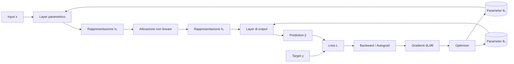

Il diagramma contiene due flussi differenti:

```text
FORWARD — produzione della prediction
Input → Layer → Hidden → Activation → Layer → Prediction

TRAINING — modifica del modello
Prediction + Target → Loss → Backward → Gradients → Optimizer
                                            ↓
                                  Parameter aggiornati
                                            ↓
                                      nuovo Forward
```

Il forward appartiene al modello. Loss, backward e optimizer appartengono al sistema di training che usa il modello.

### Input

L'input `x` è l'informazione fornita alla rete. Non è ancora “conoscenza” del modello: è il dato su cui il modello deve operare.

Esempi:

- un vettore di misure fisiche;
- i pixel di un'immagine;
- una sequenza di token;
- le feature di un oggetto astronomico;
- un batch contenente più osservazioni.

Nel framework, l'input viene rappresentato da un `Tensor`, cioè un oggetto che associa valori numerici, shape e informazioni necessarie all'eventuale calcolo dei gradienti.

```text
fenomeno osservato → rappresentazione numerica → Tensor di input
```

La scelta della rappresentazione determina quale struttura del dato diventa accessibile alla rete.

### Rappresentazione

Una rappresentazione è l'insieme dei valori con cui la rete descrive un input in un determinato punto del forward.

```text
h₀ = x                 rappresentazione iniziale
h₁                     prima rappresentazione nascosta
h₂                     seconda rappresentazione nascosta
ŷ                      rappresentazione finale / prediction
```

### Che cosa significa hidden

`Hidden` significa **interno al modello**. Una hidden representation, o rappresentazione nascosta, è il Tensor intermedio prodotto dalla rete mentre trasforma l'input nella prediction.

```text
input x
  ↓ layer
hidden representation h
  ↓ layer
prediction ŷ
```

Una definizione più precisa è:

```text
hidden representation hᵢ
  = valore del flusso computazionale
    in corrispondenza di un confine interno della rete,
    per uno specifico input x
    e per gli attuali valori dei parametri θ
```

Se il modello è:

```text
x → layer₁ → activation₁ → layer₂ → ŷ
```

possiamo scegliere come rappresentazione nascosta l'output di `activation₁`:

```text
h₁ = activation₁(layer₁(x))
```

`h₁` è quindi **un valore prodotto dal forward**, non un componente della rete.

È “nascosta” perché il dataset specifica input e target, ma non specifica quali valori debbano assumere le rappresentazioni intermedie:

```text
OSSERVATO / FORNITO             APPRESO INTERNAMENTE
input x                         hidden h
target y
```

Il training non dice direttamente al modello:

```text
“la terza componente di h deve rappresentare questa proprietà”
```

Ottimizza i parametri affinché la prediction riduca la loss. Come conseguenza, la rete costruisce rappresentazioni interne utili a quel compito.

### Che cosa rappresenta

Una hidden representation codifica l'input nel sistema di coordinate appreso dal modello.

```text
h = φ(x; θ)
```

Dipende quindi da:

- l'input specifico `x`;
- i parametri correnti `θ`;
- le trasformazioni già attraversate;
- il task e la loss attraverso cui quei parametri sono stati appresi.

In una rete che opera su sorgenti astrofisiche, una rappresentazione nascosta potrebbe organizzare implicitamente combinazioni utili di proprietà spettrali, luminosità, variabilità o morfologia. Non è però garantito che una singola coordinata corrisponda in modo pulito a una singola grandezza fisica. Spesso l'informazione è distribuita tra molte componenti.

```text
input originale
  coordinate scelte dal dataset
        ↓ rete
hidden representation
  coordinate apprese perché utili al task
```

### Hidden representation, output head e prediction

La hidden representation non è una prediction incompleta. È una descrizione interna che il modello mette a disposizione della parte finale della rete.

La struttura generale è:

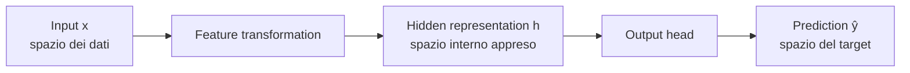

L'**output head**, o testa di output, è il componente finale che traduce l'ultima rappresentazione nascosta nello spazio richiesto dal task.

```text
hidden h
  descrizione interna appresa
        ↓ output head
prediction ŷ
  quantità con significato definito dal task
```

La distinzione tra i tre spazi è fondamentale:

```text
SPAZIO DELL'INPUT
  coordinate determinate dalla rappresentazione dei dati

SPAZIO HIDDEN
  coordinate interne scelte indirettamente dal training

SPAZIO DELL'OUTPUT
  coordinate determinate dal target e dal task
```

L'output non deve in generale avere una rappresentazione congruente con l'input. Deve avere forma e semantica congruenti con il **target**.

#### Esempio di regressione

```text
input
  20 misure osservative
        ↓
hidden
  64 feature interne apprese
        ↓ output head
prediction
  1 valore: redshift stimato
```

Qui input e output hanno dimensionalità e significati differenti.

#### Esempio di classificazione

```text
input
  20 feature di una sorgente
        ↓
hidden
  64 componenti interne
        ↓ output head
prediction
  5 punteggi, uno per classe
```

Le coordinate hidden non sono le classi. L'output head combina le 64 componenti interne per produrre i cinque valori che possiedono la semantica richiesta dal task.

#### Esempio di language model

```text
ultima hidden representation di un token
  vettore interno di dimensione d_model
        ↓ output head
logits
  un punteggio per ogni token del vocabolario
        ↓ eventuale normalizzazione
probabilità del prossimo token
```

`d_model` è la dimensione interna usata dal modello. La dimensione dell'output è invece la dimensione del vocabolario. L'output head collega i due spazi.

### L'ultima hidden representation

Una rete può produrre molte rappresentazioni nascoste:

```text
x → h₁ → h₂ → h₃ → ŷ
```

`h₁`, `h₂` e `h₃` sono tutte hidden representation. `h₃` può essere chiamata **ultima hidden representation** perché alimenta direttamente l'output head.

Soltanto in questo senso è ragionevole pensarla come “ciò che precede la prediction”:

```text
h_last → output head → prediction
```

Ma `h_last` non ha ancora necessariamente la shape o la semantica della prediction. È il materiale informativo interno da cui l'output head la costruisce.

### Definizione operativa durante il forward

Data una rete con parametri correnti `θ` e dato uno specifico input `x`, il forward produce una sequenza ordinata di Tensor intermedi.

```mermaid
flowchart LR
    X[Input<br/>h₀ = x] --> L1[Layer parametrico 1]
    L1 --> Z1[Pre-activation<br/>z₁ = W₁h₀ + b₁]
    Z1 --> A1[Activation 1]
    A1 --> H1[Post-activation<br/>h₁ = activation₁ di z₁]
    H1 --> L2[Layer parametrico 2]
    L2 --> Z2[Pre-activation<br/>z₂ = W₂h₁ + b₂]
    Z2 --> A2[Activation 2]
    A2 --> H2[Post-activation<br/>h₂ = activation₂ di z₂]
    H2 --> HEAD[Output head]
    HEAD --> YH[Prediction ŷ]
```

Nel diagramma, `aᵢ(zᵢ)` indica l'applicazione della funzione di attivazione; in forma matematica:

```text
h₀ = x
z₁ = W₁h₀ + b₁
h₁ = a₁(z₁)
z₂ = W₂h₁ + b₂
h₂ = a₂(z₂)
ŷ  = output_head(h₂)
```

La definizione operativa è:

> Una hidden representation è un Tensor intermedio prodotto in un punto interno del forward, per uno specifico input e per gli attuali valori dei parametri.

I valori prima e dopo l'attivazione possono entrambi essere considerati rappresentazioni interne, purché si specifichi quale si intende:

```text
zᵢ = hidden pre-activation
  output del layer parametrico prima della non-linearità

hᵢ = hidden post-activation
  output della funzione di attivazione passato al layer successivo
```

Nel laboratorio useremo normalmente `hᵢ` per la rappresentazione post-activation che attraversa il confine tra due layer:

```text
Layer i → zᵢ → Activation → hᵢ → Layer i+1
```

Quando la distinzione è rilevante per formula, backward o interpretazione, useremo esplicitamente `zᵢ` e `hᵢ`.

Non useremo invece il termine prediction per questi valori intermedi:

```text
zᵢ, hᵢ    hidden representation interne
ŷ         prediction finale del modello
```

### Il ruolo della storia di training

La storia del training determina come i parametri siano arrivati ai valori correnti, ma non entra nel forward come argomento separato.

```text
training history
  ↓ produce
parametri correnti θ
  ↓ insieme all'input x determinano
hidden representation hᵢ(x; θ)
```

A parità di architettura, input e parametri correnti, il forward produce le stesse hidden representation indipendentemente dal percorso seguito dal training per raggiungere quei parametri:

```text
θ_A = θ_B
      e stesso x
          ↓
hᵢ(x; θ_A) = hᵢ(x; θ_B)
```

Questa affermazione riguarda la rete feed-forward deterministica corrente. Componenti stocastici o stato operativo aggiuntivo, che introdurremo eventualmente più avanti, richiederebbero di specificare anche tali condizioni.

### Ingredienti minimi di una rete feed-forward

Possiamo ora fissare uno schema di riferimento sufficientemente preciso per i capitoli successivi:

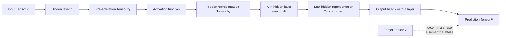

In forma lineare:

```text
Input Tensor x
  ↓
Hidden layer parametrico
  ↓
Pre-activation Tensor z
  ↓
Activation function
  ↓
Hidden representation Tensor h
  ↓
eventuali altri hidden layer
  ↓
Last hidden representation Tensor h_last
  ↓
Output head
  ↓
Prediction Tensor ŷ, congruente con il target y
```

Gli ingredienti minimi sono i seguenti.

#### Input Tensor

L'input numerico della rete è rappresentato da un `Tensor`:

```text
x.shape = (in_features,)                  singolo esempio
X.shape = (batch_size, in_features)       batch
```

Il Tensor raccoglie le componenti dell'osservazione e costituisce la rappresentazione iniziale `h₀ = x`.

#### Hidden layer

Un hidden layer è un componente interno che trasforma una rappresentazione. In una rete fully connected, cioè completamente connessa, ogni unità di output combina tutte le unità ricevute:

```text
z = Wh + b
```

È hidden perché si trova tra i confini di input e output. Il layer può possedere `Parameter`, come weight e bias.

#### Neuroni, unità e Tensor

Un neurone, o unità, non è normalmente rappresentato da un `Tensor` indipendente. È una singola componente di calcolo del layer:

```text
zⱼ = Σᵢ Wⱼᵢhᵢ + bⱼ
```

Il layer contiene molte unità. I loro valori vengono raccolti in un unico `Tensor`:

```text
singolo neurone j             valore scalare zⱼ
gruppo di n neuroni           Tensor z con shape (n,)
batch su n neuroni            Tensor Z con shape (batch_size, n)
```

Quindi:

```text
NEURONE / UNITÀ
  una coordinata della trasformazione

TENSOR DI ACTIVATION
  raccoglie i valori prodotti da tutte le unità del layer
```

Anche i parametri non sono in genere memorizzati come un Tensor separato per neurone: i pesi di tutte le unità sono raccolti nella matrice `W`, mentre i bias sono raccolti nel vettore `b`.

### Figura guida: una rete `3 → 2 → 3`

Prima di analizzare matrici e indici, raccogliamo layer, neuroni e Tensor in un'unica figura.

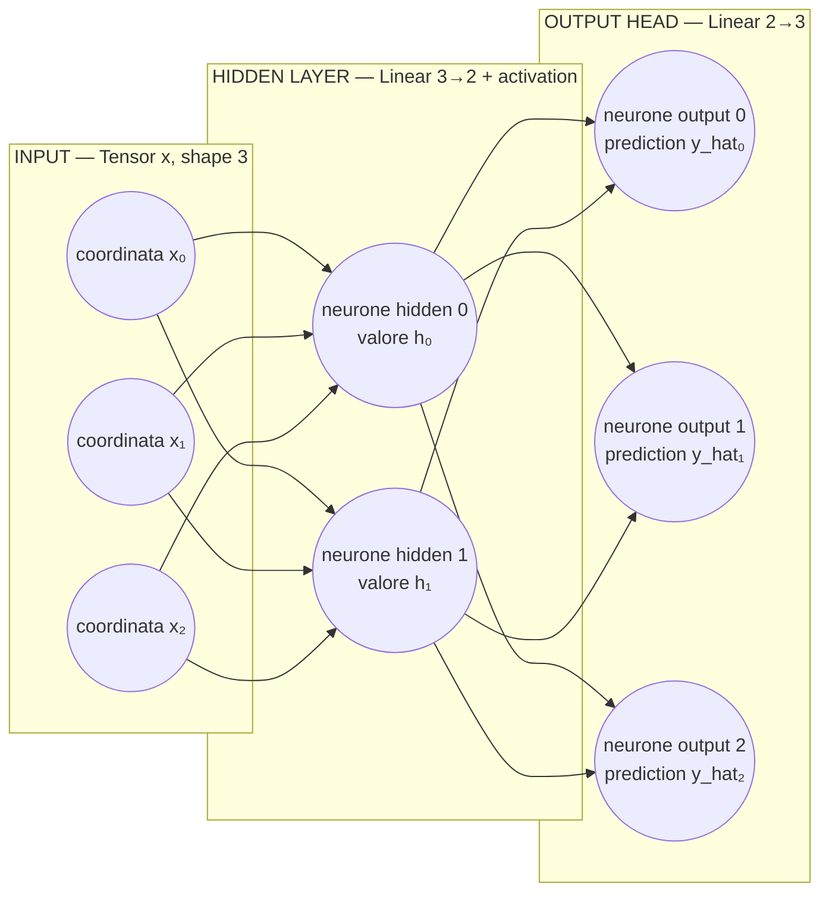

La figura va letta per **colonne**:

```text
COLONNA 1                       COLONNA 2                    COLONNA 3
Input Tensor x                 Hidden layer                 Output head
3 coordinate                   2 neuroni                    3 neuroni
[x₀, x₁, x₂]                   valori [h₀, h₁]              valori [ŷ₀, ŷ₁, ŷ₂]
shape (3,)                     hidden Tensor shape (2,)    prediction shape (3,)
```

I cerchi della prima colonna rappresentano le coordinate del dato di input. Non sono neuroni parametrizzati: non calcolano una somma pesata, ma forniscono valori ai neuroni del primo layer.

I cerchi della seconda e terza colonna rappresentano unità di calcolo:

```text
hidden layer
  2 neuroni → produce 2 valori → hidden Tensor shape (2,)

output head
  3 neuroni → produce 3 valori → prediction Tensor shape (3,)
```

La **larghezza di un layer** è il suo numero di neuroni e coincide con il numero di coordinate che quel layer produce:

```text
2 neuroni hidden       ↔ hidden dimension 2
3 neuroni output       ↔ output dimension 3
```

Ogni gruppo verticale di valori forma un Tensor al confine tra due componenti:

| Confine | Valori | Tensor | Shape |
|---|---|---|---:|
| ingresso della rete | `x₀, x₁, x₂` | `x` | `(3,)` |
| dopo il hidden layer | `h₀, h₁` | `h` | `(2,)` |
| dopo l'output head | `ŷ₀, ŷ₁, ŷ₂` | `ŷ` | `(3,)` |

Le frecce rappresentano collegamenti pesati. Poiché entrambi i layer sono fully connected:

```text
input → hidden
  3 coordinate × 2 neuroni = 6 collegamenti
  weight W¹ con shape (2, 3)

hidden → output
  2 coordinate × 3 neuroni = 6 collegamenti
  weight W² con shape (3, 2)
```

La rete completa realizza quindi due cambi di rappresentazione:

```text
x (3,)
  ↓ Linear(3,2) + activation
h (2,)
  ↓ Linear(2,3), output head
ŷ (3,)
```

Il fatto che input e prediction abbiano entrambi shape `(3,)` è soltanto una scelta di questo esempio grafico. Non è una regola generale: è l'output head, progettato in funzione del task, a stabilire la shape della prediction.

Le sezioni successive sono zoom della stessa figura:

```text
ZOOM 1    input (3,) → hidden layer con 2 neuroni
ZOOM 2    neuroni → righe della matrice dei pesi
ZOOM 3    hidden (2,) → output head con 3 neuroni
```

### Primo zoom: un layer, i suoi neuroni e i suoi pesi

Consideriamo un layer `Linear(3, 2)`: riceve tre coordinate e possiede due neuroni di output.

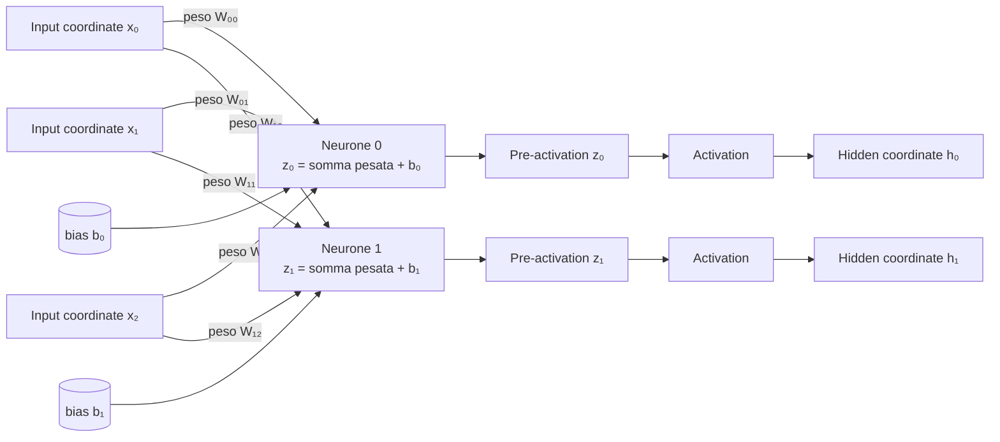

Il diagramma rappresenta una rete **fully connected**, cioè completamente connessa: ogni neurone di output riceve tutte le coordinate di input.

```text
input Tensor x
  x₀, x₁, x₂                     tre coordinate

Linear(3, 2)
  neurone 0                      usa W₀₀, W₀₁, W₀₂ e b₀
  neurone 1                      usa W₁₀, W₁₁, W₁₂ e b₁

output pre-activation Tensor z
  z₀, z₁                         due coordinate
```

#### Lettura per neurone

Non esiste una corrispondenza uno-a-uno tra coordinate di input e neuroni.

In `Linear(3, 2)`:

```text
3 coordinate di input       x₀, x₁, x₂
2 neuroni di output         neurone 0, neurone 1
6 collegamenti              3 input × 2 neuroni
6 pesi                      uno per collegamento
```

Ogni coordinata di input si collega a **entrambi** i neuroni:

```text
x₀ ─┬→ neurone 0   con peso W₀₀
    └→ neurone 1   con peso W₁₀

x₁ ─┬→ neurone 0   con peso W₀₁
    └→ neurone 1   con peso W₁₁

x₂ ─┬→ neurone 0   con peso W₀₂
    └→ neurone 1   con peso W₁₂
```

Equivalentemente, ogni neurone riceve **tutte e tre** le coordinate:

```text
neurone 0 ← x₀, x₁, x₂
neurone 1 ← x₀, x₁, x₂
```

Il neurone `j` calcola poi una singola coordinata di output:

```text
zⱼ = Σᵢ Wⱼᵢ xᵢ + bⱼ
```

Nel caso concreto:

```text
z₀ = W₀₀x₀ + W₀₁x₁ + W₀₂x₂ + b₀
z₁ = W₁₀x₀ + W₁₁x₁ + W₁₂x₂ + b₁
```

Gli indici variano indipendentemente:

```text
i = 0, 1, 2       sceglie una coordinata di input
j = 0, 1          sceglie un neurone di output
```

Per ogni coppia `(j, i)` esiste un collegamento e quindi un peso `Wⱼᵢ`:

| Coordinata di input | Verso neurone 0 | Verso neurone 1 |
|---|---:|---:|
| `x₀` | `W₀₀` | `W₁₀` |
| `x₁` | `W₀₁` | `W₁₁` |
| `x₂` | `W₀₂` | `W₁₂` |

Il numero di neuroni è determinato da `out_features = 2`, non dal numero delle coordinate di input. Il numero di coordinate ricevute da ciascun neurone è determinato da `in_features = 3`.

Il bias `bⱼ` appartiene al neurone di output `j` e sposta la sua somma pesata.

### Secondo zoom: dai collegamenti alla matrice dei pesi

Torniamo ora ai sei collegamenti tra input e hidden layer mostrati nella figura guida. Gli stessi oggetti vengono raccolti in strutture tensoriali:

```text
x = [x₀, x₁, x₂]                    shape (3,)

W = [[W₀₀, W₀₁, W₀₂],              shape (2, 3)
     [W₁₀, W₁₁, W₁₂]]

b = [b₀, b₁]                        shape (2,)

z = [z₀, z₁]                        shape (2,)
```

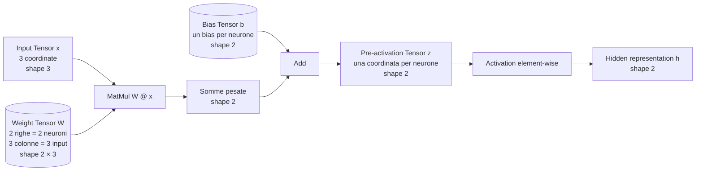

La matrice dei pesi codifica l'intero diagramma dei collegamenti:

```text
RIGHE DI W
  una riga per ogni neurone di output

COLONNE DI W
  una colonna per ogni coordinata di input

ELEMENTO Wⱼᵢ
  peso del collegamento dalla coordinata xᵢ al neurone j
```

Per questo:

```text
W.shape = (out_features, in_features)
```

e la moltiplicazione

```text
z = W @ x + b
```

produce:

```text
(2, 3) @ (3,) + (2,) → (2,)
```

La dimensione `3` viene contratta: ogni neurone combina le tre coordinate ricevute. La dimensione `2` rimane: il layer produce un valore per ciascuno dei suoi due neuroni.

#### Dal neurone alla hidden representation

Dopo la funzione di attivazione:

```text
h₀ = a(z₀)
h₁ = a(z₁)
```

i valori delle due unità vengono raccolti nel Tensor:

```text
h = [h₀, h₁]
```

Quindi la relazione precisa è:

```text
neurone j
  definisce il calcolo di una coordinata zⱼ
        ↓ activation
coordinata hidden hⱼ
        ↓ insieme alle altre coordinate
hidden representation Tensor h
```

Il Tensor `h` non è un singolo neurone: è la rappresentazione composta dai valori di tutti i neuroni del layer per quello specifico input.

#### Pre-activation Tensor

Il risultato del calcolo parametrico prima della funzione di attivazione è:

```text
z = Wh + b
```

`z` è un Tensor intermedio. Ogni sua componente `zⱼ` è il valore pre-activation di una unità.

#### Activation function

La funzione di attivazione trasforma `z` in una nuova rappresentazione:

```text
h = a(z)
```

In una rete semplice viene applicata elemento per elemento. Introduce la non-linearità necessaria affinché la composizione di più layer possa rappresentare funzioni più ricche di una singola trasformazione affine.

La funzione è un componente; `h` è il Tensor di valori che essa produce.

#### Hidden representation Tensor

`h` raccoglie le activation post-attivazione delle unità del layer:

```text
h = [h₀, h₁, ..., hₙ₋₁]
```

È il valore che viene passato al layer successivo. Una rete profonda produce una sequenza di rappresentazioni:

```text
h₁ → h₂ → ... → h_last
```

#### Last hidden representation

`h_last` è l'ultima rappresentazione interna prima dell'output head. È ancora un `Tensor`:

```text
h_last.shape = (hidden_dimension,)
```

oppure, per un batch:

```text
H_last.shape = (batch_size, hidden_dimension)
```

Non è ancora necessariamente la prediction. La sua shape e le sue coordinate appartengono allo spazio interno appreso dal modello.

#### Output head o output layer

L'output head prende `h_last` e la mappa nello spazio del task:

```text
ŷ = head(h_last)
```

Spesso la testa è un ultimo layer `Linear`, ma può includere altre operazioni a seconda del task.

La sua responsabilità non è restituire la shape dell'input. È produrre la shape e la semantica richieste dal target:

```text
regressione scalare
  input (20,) → hidden (64,) → prediction (1,) → target (1,)

classificazione a 5 classi
  input (20,) → hidden (64,) → prediction (5,) → target definito su 5 classi

language model
  hidden (d_model,) → logits (vocabulary_size,)
```

### Terzo zoom: come l'output head trasforma `(2,)` in `(3,)`

Torniamo alla parte destra della figura guida. L'ultima hidden representation ha due coordinate, mentre il task richiede tre valori di output:

```text
h_last.shape = (2,)
target.shape = (3,)
```

Il numero `2` descrive quante coordinate entrano nella testa. Il numero `3` descrive quanti valori la testa deve produrre.

La trasformazione avviene in tre passaggi:

```text
1. h_last contiene 2 coordinate: [h₀, h₁]
2. la testa possiede 3 neuroni; ciascuno legge h₀ e h₁
3. i 3 scalari prodotti diventano le coordinate di ŷ: [ŷ₀, ŷ₁, ŷ₂]
```

#### Vista dei collegamenti tra coordinate e neuroni

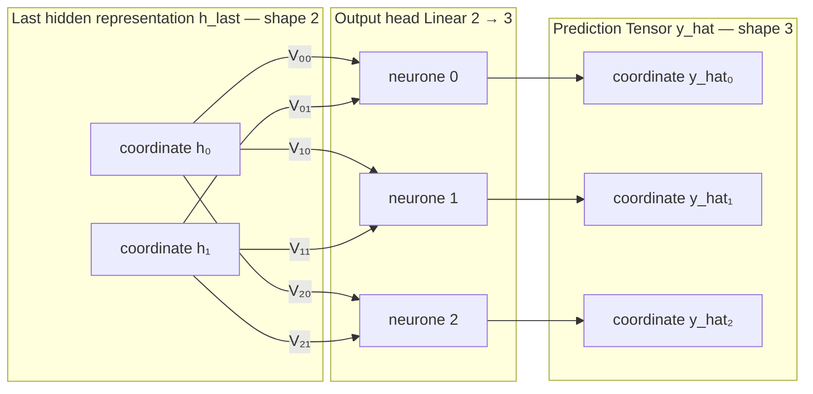

La testa è completamente connessa: le due coordinate hidden arrivano a tutti e tre i neuroni. Ogni freccia possiede un peso. I bias, omessi dal diagramma per non sovraccaricarlo, sono uno per neurone: `c₀`, `c₁`, `c₂`.

Il punto essenziale è che un neurone di output produce **un solo scalare**:

```text
neurone 0 → ŷ₀
neurone 1 → ŷ₁
neurone 2 → ŷ₂
                 ↓ assemblaggio
prediction ŷ = [ŷ₀, ŷ₁, ŷ₂]
```

#### Vista dai Tensor alla loss

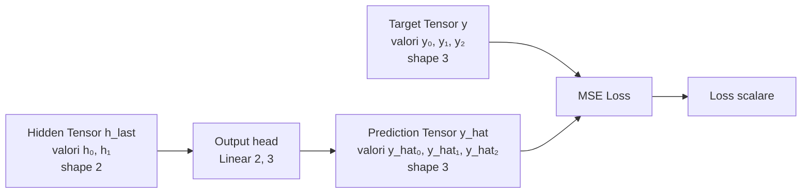

La hidden representation entra nel modello finale; il target non entra nell'output head. Prediction e target si incontrano soltanto nella loss.

#### Vista della stessa trasformazione come algebra

In forma tensoriale, la testa è un `Linear(2, 3)`:

```text
h_last = [h₀, h₁]                         shape (2,)

V = [[V₀₀, V₀₁],                          shape (3, 2)
     [V₁₀, V₁₁],
     [V₂₀, V₂₁]]

c = [c₀, c₁, c₂]                          shape (3,)

ŷ = V @ h_last + c                        shape (3,)
```

Ogni neurone della testa costruisce una coordinata della prediction:

```text
ŷ₀ = V₀₀h₀ + V₀₁h₁ + c₀
ŷ₁ = V₁₀h₀ + V₁₁h₁ + c₁
ŷ₂ = V₂₀h₀ + V₂₁h₁ + c₂
```

Le shape seguono direttamente da `MatMul`:

```text
(3, 2) @ (2,) + (3,) → (3,)
```

La dimensione hidden `2` viene contratta: compare nelle due colonne di `V` e nelle due coordinate di `h_last`, ma non nell'output. La dimensione `3` rimane perché corrisponde alle tre righe di `V`, ai tre neuroni della testa e alle tre coordinate della prediction.

```text
2 coordinate hidden
  ↔ 2 colonne della matrice V
  ↔ 2 ingressi per ciascun neurone

3 coordinate di output
  ↔ 3 righe della matrice V
  ↔ 3 neuroni della testa
  ↔ 3 valori nel Tensor prediction
```

In sintesi:

```text
hidden Tensor (2,)
      ↓ Linear(2, 3)
3 neuroni, ognuno legge 2 valori
      ↓
3 scalari assemblati
      ↓
prediction Tensor (3,)
      ↓ confronto MSE con
target Tensor (3,)
```

### Input e target non devono avere la stessa shape

Non esiste una regola generale:

```text
input.shape = target.shape
```

Input e target descrivono oggetti con ruoli diversi:

```text
input
  informazione disponibile al modello

target
  quantità che il task chiede di predire
```

Per esempio:

```text
input.shape   = (20,)       venti misure osservative
hidden.shape  = (64,)       rappresentazione interna
prediction    = (3,)        tre quantità da stimare
target.shape  = (3,)        tre valori osservati
```

Qui la rete può essere schematizzata come:

```text
(20,) → hidden layers → (64,) → Linear(64,3) → (3,)
 input                               head       prediction
```

### Prediction e target: compatibilità richiesta dalla loss

Ciò che deve essere compatibile è la prediction con il target secondo il contratto della loss.

Nella `MSELoss` attuale di MyTorch il contratto è particolarmente semplice:

```text
prediction.shape = target.shape
```

perché la loss sottrae i due Tensor elemento per elemento:

```text
MSE = mean((prediction - target)²)
```

Questa è una proprietà della loss implementata, non una legge universale delle reti neurali.

In una classificazione futura, per esempio, potremmo avere:

```text
prediction logits.shape = (5,)     cinque punteggi di classe
target                   = 2       indice scalare della classe corretta
```

Una cross-entropy può confrontare queste rappresentazioni differenti perché interpreta il target scalare come indice della classe corretta. In quel caso prediction e target sono semanticamente compatibili con la loss, ma non hanno la stessa shape.

La relazione corretta è quindi:

```text
prediction e target devono rispettare il contratto della loss
```

non:

```text
prediction.shape = input.shape
```

Nel caso specifico della MSE corrente:

```text
prediction.shape = target.shape
```

#### Prediction Tensor

La prediction è il `Tensor` finale prodotto dal modello. È l'unico valore del forward a cui il task assegna direttamente una semantica esterna:

```text
hidden representation    significato interno appreso
prediction               significato definito dal problema
```

La loss confronterà questa prediction con il target e collegherà il modello al training loop.

### Formula canonica

Per una rete feed-forward con `L` trasformazioni nascoste:

```text
h₀ = x

per l = 1, ..., L:
    zₗ = Wₗhₗ₋₁ + bₗ
    hₗ = aₗ(zₗ)

ŷ = head(h_L)
```

Questa formula sarà lo schema di riferimento. Le architetture successive — convoluzionali, ricorrenti e Transformer — modificheranno il tipo di trasformazione e l'organizzazione delle rappresentazioni, ma conserveranno la domanda fondamentale:

```text
come viene trasformato un Input Tensor
in rappresentazioni interne
e infine in una prediction adatta al task?
```

### Il caso concreto di TinyNet

La rete didattica di MyTorch è:

```text
x (1,)
  ↓ Linear(1, 4)
z (4,)                    pre-activation
  ↓ ReLU
h (4,)                    hidden representation
  ↓ Linear(4, 1)          output head
ŷ (1,)                    prediction
```

In formule:

```text
z = W₁x + b₁
h = ReLU(z)
ŷ = W₂h + b₂
```

Gli oggetti hanno ruoli differenti:

| Oggetto | Che cos'è | Persistente? | Semantica |
|---|---|---:|---|
| `W₁, b₁, W₂, b₂` | Parameter | sì | stato apprendibile |
| `z` | Tensor intermedio | no | combinazione affine interna |
| `h` | hidden representation | no | feature interne dopo ReLU |
| `ŷ` | prediction | no | stima nello spazio del target |

Supponiamo che per un input il primo layer produca:

```text
z = [0.7, -1.2, 0.3, 2.1]
```

Dopo ReLU:

```text
h = [0.7, 0.0, 0.3, 2.1]
```

Questo vettore non è ancora la stima di `x²`. Il secondo `Linear` lo combina:

```text
ŷ = W₂h + b₂
```

e produce un solo valore con la stessa forma del target `[x²]`.

La formulazione precisa è quindi:

> L'ultima hidden representation è il valore interno che riassume, nelle coordinate apprese dal modello, l'informazione disponibile prima dell'output head. L'output head la trasforma nella prediction, la cui forma e semantica sono definite dal target del task.

### Confine tra rete e training system

Con `TinyNet` abbiamo completato il percorso interno del modello:

```text
input → hidden layer → hidden representation → output head → prediction
```

Layer, activation, `Parameter`, hidden representation e prediction sono già stati definiti negli schemi precedenti. Rimane soltanto da ricollocare la rete nel sistema più ampio mostrato all'inizio della sezione.

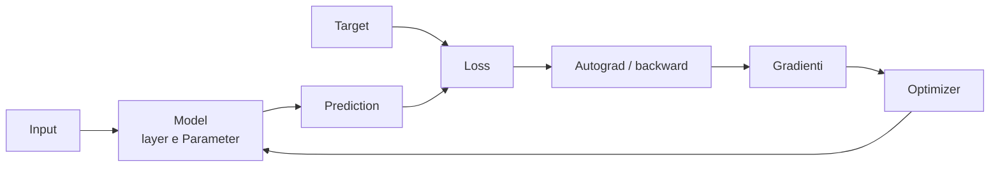

Gli ingredienti esterni al forward vengono qui soltanto collocati; saranno sviluppati nei capitoli 2 e 3:

- **target** — riferimento fornito dal dataset o dal task;
- **loss** — criterio che confronta prediction e target e produce l'obiettivo;
- **computational graph** — storia delle operazioni eseguite nel forward;
- **Autograd / backward** — meccanismo che usa quella storia per calcolare i gradienti;
- **gradienti** — sensibilità della loss rispetto ai parametri;
- **optimizer** — componente che usa i gradienti per aggiornare i parametri.

Il confine fondamentale è:

```text
MODELLO
  input → prediction

TRAINING SYSTEM
  prediction + target → loss → gradienti → parameter update
```

Un **blocco** è invece un livello organizzativo interno al modello: raggruppa più layer e operazioni in una componente riutilizzabile. `TinyNet` è abbastanza piccola da non richiederlo; nei Transformer il blocco diventerà l'unità architetturale ripetuta.

### Le quattro viste della stessa rete

Ora possiamo ricomporre gli ingredienti nelle quattro prospettive che useremo nel libro:

| Prospettiva | Oggetto osservato | Domanda |
|---|---|---|
| Matematica | `f(x; θ)` come composizione di funzioni | Quale trasformazione viene appresa? |
| Architettura software | gerarchia di Model, Block, Module e layer | Come è organizzato il sistema? |
| Stato | insieme dei Parameter | Quali valori persistono e cambiano? |
| Esecuzione | forward, grafo, backward e update | Che cosa accade in una iterazione? |

```text
MATEMATICA
h₁ = φ₁(x; θ₁), h₂ = φ₂(h₁; θ₂), ŷ = φ₃(h₂; θ₃)

ARCHITETTURA
Model → Block → Layer / Activation

STATO
θ = {weight₁, bias₁, weight₂, bias₂, ...}

ESECUZIONE
forward → loss → backward → optimizer → nuovo forward
```

Questa è la big picture a cui torneremo dopo ogni deep dive. I capitoli successivi non introducono oggetti isolati: ingrandiscono, uno alla volta, gli ingredienti di questo diagramma e mostrano come cooperano nel sistema completo.

---

## 1.5 I tre livelli di lettura

Ogni concetto del laboratorio può essere osservato almeno a tre livelli.

### Matematica

Descrive la trasformazione e le sue proprietà:

```text
y = Wx + b
∂L/∂x = (∂L/∂y)(∂y/∂x)
```

Domanda tipica:

```text
Quale relazione stiamo calcolando?
```

### Architettura

Assegna responsabilità e dipendenze:

```text
Tensor trasporta valori
Operation trasforma Tensor
Module organizza Parameter e forward
Optimizer aggiorna Parameter
```

Domanda tipica:

```text
Quale componente deve conoscere questa informazione?
```

### Implementazione

Traduce i contratti in codice concreto:

```python
result.creator = self
self.inputs = inputs
```

Domanda tipica:

```text
Come viene rappresentata questa relazione nel repository?
```

I tre livelli sono connessi, ma non intercambiabili. Una formula corretta non determina da sola una buona separazione software; un'API elegante non garantisce una derivata corretta; un dettaglio implementativo non deve essere scambiato per una necessità matematica.

Nel laboratorio segnaleremo esplicitamente i cambi di livello.

---

## 1.6 I livelli architetturali di MyTorch

La MAP raggruppa i componenti correnti in tre livelli.

### Core computazionale

```text
Tensor → Operation → Computational Graph → Autograd
```

Il core risponde alla domanda:

```text
Come rappresentiamo, componiamo e differenziamo una computazione?
```

Non conosce ancora il significato di modello, layer o training.

### Composizione del modello

```text
Parameter → Module → Linear → Neural Network
```

Questo livello risponde alla domanda:

```text
Quali Tensor costituiscono lo stato apprendibile e come vengono organizzati?
```

Riusa il core senza introdurre un secondo sistema di calcolo.

### Training loop

```text
Prediction → Loss → Backward → Gradients
           → Optimizer → Parameter Update
           ↺ nuovo Forward
```

Il training loop risponde alla domanda:

```text
Come trasformiamo una valutazione della prediction
in una modifica dello stato apprendibile?
```

L'apprendimento emerge dalla cooperazione tra questi livelli. Non risiede in una singola classe.

---

## 1.7 Struttura stabile e computazione dinamica

Due tipi di struttura attraverseranno tutto il laboratorio.

La gerarchia del modello è relativamente stabile:

```text
Model
├── Layer
│   ├── weight
│   └── bias
└── Layer
    ├── weight
    └── bias
```

Descrive quali componenti esistono e quali parametri possiedono.

Il grafo computazionale emerge invece durante uno specifico forward:

```text
input → MatMul → Add → ReLU → MatMul → Add → prediction
```

Descrive quali operazioni sono state effettivamente eseguite e conserva il percorso necessario al backward.

```text
MODEL STRUCTURE                 COMPUTATIONAL GRAPH
ownership e composizione       storia causale del calcolo
Module e Parameter             Tensor e Operation
persiste tra i forward         nasce durante un forward
```

Comprendere questa distinzione impedisce di confondere la rete come oggetto software con il grafo prodotto da una sua esecuzione.

---

## 1.8 Che cosa MyTorch rende intenzionalmente semplice

MyTorch non è una libreria numerica di produzione. Alcune limitazioni sono deliberate:

```text
dati             scalari e liste Python annidate
esecuzione       CPU, senza kernel specializzati
Autograd         traversal ricorsivo leggibile
API              insieme minimo di operazioni
ottimizzazione   SGD elementare
```

Queste scelte riducono la distanza tra concetto e codice. Per esempio, una moltiplicazione esplicita tra liste è inefficiente, ma consente di osservare quali indici vengono combinati e quali contributi vengono sommati nel backward.

Una limitazione didattica è utile finché rende visibile un principio. Quando comincia a nasconderlo o a impedire esperimenti significativi, diventa la frontiera da superare.

Questo criterio guiderà l'evoluzione del framework:

```text
implementazione minima
        ↓
comprensione del contratto
        ↓
identificazione del limite
        ↓
generalizzazione controllata
```

---

## 1.9 MyTorch e PyTorch

MyTorch e PyTorch non sono alternative concorrenti nel percorso.

```text
MyTorch
  laboratorio dei principi
  implementazioni piccole e ispezionabili
  verifica diretta di forward e backward

PyTorch
  framework per scala e produzione
  tensori vettorizzati, GPU e strumenti maturi
  modelli ed esperimenti realistici
```

Il passaggio tra i due seguirà un ciclo:

```text
comprendere il concetto
        ↓
implementarlo in MyTorch
        ↓
riprodurlo in PyTorch
        ↓
confrontare valori, shape e gradienti
        ↓
usare PyTorch alla scala reale
```

MyTorch rimarrà disponibile anche dopo l'introduzione di PyTorch. Quando un'astrazione produttiva diventerà opaca, potremo tornare alla sua versione minima per ricostruirne il funzionamento.

---

## 1.10 Dalla rete neurale al modello esperto

La direzione di lungo periodo del laboratorio è costruire sistemi linguistici specializzati, con particolare attenzione ai domini scientifici.

Il percorso architetturale è:

```text
CORE COMPUTAZIONALE
  ↓
RETI NEURALI
  ↓
TRAINING
  ↓
SCALABILITÀ
  ↓
EMBEDDING E SEQUENZE
  ↓
ATTENTION
  ↓
TRANSFORMER
  ↓
LANGUAGE MODEL
  ↓
MODELLO ESPERTO DI DOMINIO
```

La parte finale non consisterà necessariamente nell'addestrare da zero un grande foundation model. Un sistema scientifico esperto può combinare:

```text
modello pretrained
        +
corpus curato
        +
retrieval
        +
fine-tuning efficiente
        +
valutazione specifica del dominio
```

MyTorch renderà comprensibili i componenti fondamentali. PyTorch e gli strumenti del suo ecosistema renderanno praticabili training, fine-tuning e valutazione su scala utile.

---

## 1.11 Come leggere i capitoli successivi

Ogni nuovo nodo dovrebbe rispondere a quattro domande:

```text
DOVE
  in quale punto della MAP si colloca?

DA COSA DIPENDE
  quali concetti e componenti usa?

CHE COSA FA
  quale responsabilità introduce?

CHI DIPENDE DA ESSO
  quale livello successivo rende possibile?
```

Quando il concetto è implementato, la spiegazione viene collegata al codice reale del repository. Gli snippet non sostituiscono la spiegazione: verificano che il contratto descritto esista realmente nell'implementazione.

Il capitolo 2 entra nel primo livello della mappa:

```text
Tensor → Operation → Computational Graph → Autograd
```

e mostra come, sopra quel core, emergano `Parameter`, `Module`, layer e modello.

---

## Ricomposizione: dalla rete ai componenti

Siamo partiti dalla rete completa e l'abbiamo osservata come funzione, gerarchia, stato ed esecuzione. MyTorch la scompone non perché questi aspetti siano indipendenti, ma perché possano cooperare attraverso contratti espliciti:

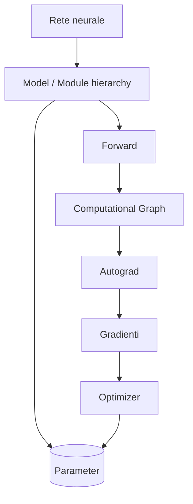

```text
RETE NEURALE
  composizione di trasformazioni parametriche
        ↓ viene rappresentata da
MODEL / MODULE
  gerarchia che possiede layer e Parameter
        ↓ durante il forward genera
COMPUTATIONAL GRAPH
  storia delle Operations applicate ai Tensor
        ↓ permette
AUTOGRAD + OPTIMIZER
  calcolo dei gradienti e aggiornamento dello stato
```

Il capitolo 2 effettuerà il primo deep dive nel core computazionale. L'oggetto finale da ricordare rimane però la rete: Tensor, Operation e grafo sono l'infrastruttura che consente ai suoi layer di comporsi e apprendere.

## Sintesi del capitolo

```text
PROBLEMA MATEMATICO
apprendere una funzione parametrica
        ↓
PROBLEMA ARCHITETTURALE
separare valori, operazioni, gradienti, stato e aggiornamento
        ↓
MYTORCH
rendere visibili e implementabili questi contratti
        ↓
PYTORCH
applicare gli stessi principi alla scala reale
        ↓
OBIETTIVO
progettare e costruire sistemi AI specialistici
```

MyTorch non è un esercizio preliminare da dimenticare. È lo strumento con cui costruiremo la mappa dei principi; PyTorch sarà il termine di confronto e il mezzo operativo quando la scala diventerà parte essenziale del problema.
