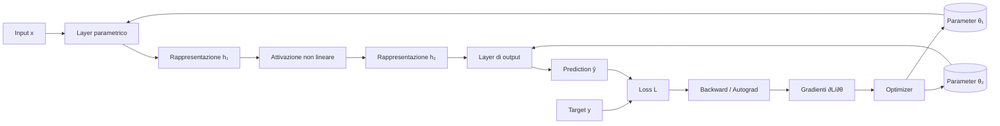

# 01 — Costruire un framework per comprendere il Deep Learning

## Scopo del capitolo

Questo capitolo fornisce la piantina del laboratorio prima di entrare nei singoli componenti. Non introduce ancora l'implementazione dettagliata di Tensor, Autograd o reti neurali; chiarisce invece perché questi oggetti esistono, quali responsabilità separano e come devono essere letti.

L'obiettivo di AI Lab non è imparare una sequenza di API. È costruire una mappa mentale che colleghi:

```text
matematica
    ↓
algoritmi
    ↓
architettura software
    ↓
implementazione
    ↓
sistemi di Deep Learning reali
```

MyTorch è il laboratorio in cui queste relazioni vengono rese visibili.

## Zoom out iniziale: dalla AI moderna al componente

La destinazione di lungo periodo è un sistema AI specializzato; MyTorch occupa il livello fondazionale di questa traiettoria:

```text
SISTEMA AI ESPERTO
  usa un Language Model dentro dati, retrieval e valutazione
        ↑
LANGUAGE MODEL / TRANSFORMER
  compone blocchi, attention e rappresentazioni di token
        ↑
RETE NEURALE
  compone layer e Parameter in una funzione apprendibile
        ↑
FRAMEWORK
  fornisce Tensor, Operations, Autograd, Module e Optimizer
        ↑
MYTORCH
  rende espliciti i contratti minimi del framework
```

Questo capitolo mantiene lo zoom più ampio: osserva prima la rete e il sistema di training come oggetti completi. I capitoli successivi scenderanno progressivamente nei sottosistemi, ma dovranno sempre ritornare a questa vista per mostrare che cosa il nuovo componente ha reso possibile.

---

## 1.1 Perché costruire MyTorch

Un framework maturo come PyTorch permette di definire e addestrare un modello con poche righe:

```python
prediction = model(x)
loss = loss_fn(prediction, target)
loss.backward()
optimizer.step()
```

Questa sintesi è necessaria per lavorare su problemi reali, ma nasconde numerosi meccanismi:

```text
Che cos'è l'oggetto che attraversa il modello?
Come viene registrata la storia del calcolo?
Chi conosce la derivata di ciascuna operazione?
Come raggiunge il gradiente un peso usato molte operazioni prima?
Come vengono identificati i valori apprendibili?
Chi li organizza e chi li modifica?
```

MyTorch ricostruisce una versione minima di questi meccanismi. Lo scopo non è competere con PyTorch, ma eliminare temporaneamente l'opacità prodotta da un'infrastruttura industriale.

```text
PyTorch
  comprime molti livelli dietro un'API produttiva

MyTorch
  separa quei livelli affinché possano essere osservati
```

Implementare significa trasformare una definizione concettuale in un contratto eseguibile. Quando il contratto è incompleto, il codice rende visibile ciò che manca. Quando due concetti sono stati confusi, le responsabilità delle classi tendono a sovrapporsi. MyTorch viene quindi usato anche come strumento di ragionamento.

---

## 1.2 Il problema fondamentale: apprendere una funzione

Al livello matematico, un modello parametrico produce una prediction:

```text
ŷ = f(x; θ)
```

dove:

```text
x    input
θ    parametri del modello
f    trasformazione parametrica
ŷ    prediction
```

Un criterio confronta la prediction con un target `y`:

```text
L = loss(ŷ, y)
```

L'apprendimento modifica i parametri per migliorare quel criterio:

```text
θ ← θ - η ∇θL
```

Queste tre espressioni contengono il nucleo matematico del training:

```text
FORWARD
x, θ → prediction

VALUTAZIONE
prediction, target → loss

OTTIMIZZAZIONE
loss → gradients → parameter update
```

Ma non specificano ancora come costruire un sistema software capace di eseguirle su modelli composti da molte trasformazioni. Il framework colma questa distanza.

---

## 1.3 Dalla formula al sistema

Una formula descrive una relazione. Un framework deve trasformarla in oggetti con responsabilità precise.

Per realizzare

```text
ŷ = f(x; θ)
```

servono almeno:

- un oggetto che rappresenti valori e shape;
- operazioni capaci di trasformare quei valori;
- un modo per comporre le operazioni;
- una memoria della computazione eseguita;
- regole locali per propagare gradienti;
- un'identità per i valori apprendibili;
- una struttura che organizzi il modello;
- una regola che aggiorni i parametri.

La mappa minima diventa:

```text
DATA
  ↓
TENSOR
  ↓
OPERATION
  ↓
COMPUTATIONAL GRAPH
  ↓
AUTOGRAD
  ↓
PARAMETER
  ↓
MODULE / LAYER
  ↓
MODEL
  ↓
PREDICTION
  ↓
LOSS
  ↓
BACKWARD
  ↓
GRADIENTS
  ↓
OPTIMIZER
  ↓
PARAMETER UPDATE
  ↺ nuovo forward
```

Questa non è una semplice lista di classi. È una decomposizione delle responsabilità necessarie a un sistema di apprendimento differenziabile.

---

## 1.4 Anatomia generale di una rete neurale

Prima di scomporre il framework nei suoi componenti, osserviamo l'intero sistema. Una rete neurale non è semplicemente una successione di matrici: è una funzione parametrica organizzata in layer, eseguita su dati rappresentati come Tensor e inserita in un ciclo che misura l'errore e modifica i parametri.

### Diagramma complessivo



Il diagramma contiene due flussi differenti:

```text
FORWARD — produzione della prediction
Input → Layer → Hidden → Activation → Layer → Prediction

TRAINING — modifica del modello
Prediction + Target → Loss → Backward → Gradients → Optimizer
                                            ↓
                                  Parameter aggiornati
                                            ↓
                                      nuovo Forward
```

Il forward appartiene al modello. Loss, backward e optimizer appartengono al sistema di training che usa il modello.

### 1. Input

L'input `x` è l'informazione fornita alla rete. Non è ancora “conoscenza” del modello: è il dato su cui il modello deve operare.

Esempi:

- un vettore di misure fisiche;
- i pixel di un'immagine;
- una sequenza di token;
- le feature di un oggetto astronomico;
- un batch contenente più osservazioni.

Nel framework, l'input viene rappresentato da un `Tensor`, cioè un oggetto che associa valori numerici, shape e informazioni necessarie all'eventuale calcolo dei gradienti.

```text
fenomeno osservato → rappresentazione numerica → Tensor di input
```

La scelta della rappresentazione determina quale struttura del dato diventa accessibile alla rete.

### 2. Rappresentazione

Una rappresentazione è l'insieme dei valori con cui la rete descrive un input in un determinato punto del forward.

```text
h₀ = x                 rappresentazione iniziale
h₁                     prima rappresentazione nascosta
h₂                     seconda rappresentazione nascosta
ŷ                      rappresentazione finale / prediction
```

Il termine “nascosta” non significa misteriosa o inosservabile. Significa soltanto che quella rappresentazione è interna al modello: non coincide né con l'input fornito né con l'output richiesto.

Un layer non “contiene” una rappresentazione in modo permanente. La produce durante il forward e la passa al layer successivo.

### 3. Layer

Un layer è un componente che trasforma una rappresentazione in un'altra:

```text
input representation → layer → output representation
```

Matematicamente:

```text
hᵢ₊₁ = φᵢ(hᵢ; θᵢ)
```

Un layer può:

- possedere parametri apprendibili;
- non possedere parametri e applicare una trasformazione fissa;
- modificare la dimensionalità della rappresentazione;
- conservarne la shape ma modificarne i valori;
- essere composto da altri layer.

In MyTorch, un layer viene implementato come un `Module`. `Module` è però più generale: può rappresentare anche un blocco composto o l'intero modello.

### 4. Layer parametrico

Un layer parametrico possiede valori che il training può modificare. Un esempio è il layer affine `Linear`:

```text
h = Wx + b
```

`W` e `b` non sono dati di input e non sono risultati temporanei: sono lo stato apprendibile del layer.

Il layer usa gli stessi parametri per tutti gli esempi che riceve. Imparare significa trovare valori di `W` e `b` che rendano utile la trasformazione per il task.

### 5. Parameter

Un `Parameter` è un `Tensor` che appartiene allo stato apprendibile del modello.

```text
Tensor
  valore che partecipa alla computazione

Parameter
  Tensor che il modello possiede e l'optimizer può aggiornare
```

I parametri sono presenti prima del forward, vengono letti dai layer durante il forward, ricevono gradienti durante il backward e vengono modificati dall'optimizer.

La conoscenza appresa da una rete risiede principalmente nei valori e nelle relazioni dei suoi parametri, non nel codice della classe che descrive il modello.

### 6. Funzione di attivazione

Una funzione di attivazione trasforma i valori prodotti da un layer, generalmente elemento per elemento. Il suo ruolo principale è introdurre non-linearità.

Senza funzioni non lineari, una catena di layer affini collasserebbe in un'unica trasformazione affine:

```text
W₂(W₁x + b₁) + b₂
= (W₂W₁)x + (W₂b₁ + b₂)
```

La profondità non aggiungerebbe quindi una nuova classe di funzioni. Una activation non lineare tra i layer impedisce questo collasso.

Nel capitolo 2 introdurremo `ReLU` — Rectified Linear Unit — definita da `max(0, x)`. Per ora è sufficiente collocarla qui:

```text
layer parametrico → activation non lineare → nuovo layer
```

### 7. Blocco

Un blocco è una composizione riutilizzabile di più layer e operazioni. Introduce un livello di organizzazione intermedio:

```text
Model
├── Block
│   ├── Layer
│   ├── Activation
│   └── Layer
└── Output Layer
```

Nelle reti semplici possiamo comporre direttamente i layer. Nelle architetture moderne, come i Transformer, il blocco diventa l'unità strutturale ripetuta molte volte.

### 8. Modello o rete

Il modello è la composizione completa che mappa input in prediction:

```text
ŷ = f(x; θ)
```

dove `θ` indica collettivamente tutti i parametri posseduti dai suoi layer e blocchi.

Il modello stabilisce:

- quali componenti esistono;
- come sono collegati;
- quali parametri possiedono;
- quale sequenza di trasformazioni costituisce il forward.

Il modello non decide autonomamente quale prediction sia corretta e non aggiorna da solo i propri parametri.

### 9. Prediction

La prediction `ŷ` è l'output prodotto dal modello per un input. La sua interpretazione dipende dal task:

- un valore continuo in regressione;
- punteggi o probabilità per classi;
- una sequenza di output;
- punteggi sui possibili token successivi in un language model.

La prediction è il confine di responsabilità del modello. Durante il training conserva però il collegamento computazionale ai layer e ai parametri che l'hanno prodotta.

### 10. Target

Il target `y` è il riferimento rispetto al quale viene valutata la prediction nel training supervisionato.

```text
prediction ŷ    ciò che il modello produce
target y        ciò che il dataset richiede
```

Il target non è prodotto dal modello e normalmente non è apprendibile. Proviene dai dati o dalla costruzione del task.

### 11. Loss

La loss trasforma il confronto tra prediction e target in un obiettivo numerico, generalmente scalare:

```text
L = loss(ŷ, y)
```

La loss definisce che cosa significhi “errore” per il task. Cambiare loss può cambiare ciò che il modello viene incentivato ad apprendere, anche mantenendo invariata la rete.

La loss non aggiorna i parametri. Costruisce la quantità rispetto alla quale verranno calcolati i gradienti.

### 12. Forward

Il forward è l'esecuzione del modello dall'input alla prediction:

```text
x → f(x; θ) → ŷ
```

Durante il forward:

- i layer leggono input e parametri;
- vengono prodotti Tensor intermedi;
- viene costruito il grafo delle operazioni eseguite;
- i parametri non vengono modificati.

“Forward” indica quindi sia la direzione concettuale del calcolo sia il metodo con cui un `Module` definisce la propria trasformazione.

### 13. Computational graph

Il grafo computazionale è la storia delle operazioni che hanno prodotto la prediction e, successivamente, la loss.

```text
Tensor e Parameter → Operations → Tensor intermedi → prediction → loss
```

Non coincide con il diagramma dei layer. Il diagramma dei layer descrive la struttura del modello; il grafo descrive una sua esecuzione concreta e contiene il dettaglio necessario per il backward.

### 14. Backward e Autograd

Il backward percorre il grafo dalla loss verso gli input e i parametri. `Autograd`, abbreviazione di automatic differentiation, è il meccanismo che coordina questa propagazione automatica delle derivate locali.

```text
loss → prediction → hidden representations → Parameter
```

Il backward calcola gradienti. Non modifica ancora i parametri.

### 15. Gradiente

Per un parametro `θ`, il gradiente

```text
∂L/∂θ
```

misura la sensibilità locale della loss rispetto a una variazione del parametro. Tutti i parametri del modello ricevono il proprio gradiente attraverso i cammini che li collegano alla loss.

Il gradiente è informazione sul cambiamento della loss; non è di per sé una regola di aggiornamento.

### 16. Optimizer

L'optimizer legge parametri e gradienti e applica una strategia di aggiornamento. Nella forma più semplice della discesa del gradiente:

```text
θ ← θ - η ∂L/∂θ
```

dove `η` è il learning rate, cioè la scala del passo.

L'optimizer:

- non produce la prediction;
- non definisce la loss;
- non calcola il gradiente;
- modifica lo stato apprendibile usando gradienti già calcolati.

### 17. Iterazione di training

Una singola iterazione completa è:

```text
1. input e target
2. forward del modello
3. calcolo della loss
4. backward e gradienti
5. aggiornamento dei parametri
6. nuovo forward con il modello modificato
```

L'apprendimento non risiede in uno di questi ingredienti isolato. Emerge dalla loro cooperazione ripetuta su dati diversi.

### Le quattro viste della stessa rete

Ora possiamo ricomporre gli ingredienti nelle quattro prospettive che useremo nel libro:

| Prospettiva | Oggetto osservato | Domanda |
|---|---|---|
| Matematica | `f(x; θ)` come composizione di funzioni | Quale trasformazione viene appresa? |
| Architettura software | gerarchia di Model, Block, Module e layer | Come è organizzato il sistema? |
| Stato | insieme dei Parameter | Quali valori persistono e cambiano? |
| Esecuzione | forward, grafo, backward e update | Che cosa accade in una iterazione? |

```text
MATEMATICA
h₁ = φ₁(x; θ₁), h₂ = φ₂(h₁; θ₂), ŷ = φ₃(h₂; θ₃)

ARCHITETTURA
Model → Block → Layer / Activation

STATO
θ = {weight₁, bias₁, weight₂, bias₂, ...}

ESECUZIONE
forward → loss → backward → optimizer → nuovo forward
```

Questa è la big picture a cui torneremo dopo ogni deep dive. I capitoli successivi non introducono oggetti isolati: ingrandiscono, uno alla volta, gli ingredienti di questo diagramma e mostrano come cooperano nel sistema completo.

---

## 1.5 I tre livelli di lettura

Ogni concetto del laboratorio può essere osservato almeno a tre livelli.

### Matematica

Descrive la trasformazione e le sue proprietà:

```text
y = Wx + b
∂L/∂x = (∂L/∂y)(∂y/∂x)
```

Domanda tipica:

```text
Quale relazione stiamo calcolando?
```

### Architettura

Assegna responsabilità e dipendenze:

```text
Tensor trasporta valori
Operation trasforma Tensor
Module organizza Parameter e forward
Optimizer aggiorna Parameter
```

Domanda tipica:

```text
Quale componente deve conoscere questa informazione?
```

### Implementazione

Traduce i contratti in codice concreto:

```python
result.creator = self
self.inputs = inputs
```

Domanda tipica:

```text
Come viene rappresentata questa relazione nel repository?
```

I tre livelli sono connessi, ma non intercambiabili. Una formula corretta non determina da sola una buona separazione software; un'API elegante non garantisce una derivata corretta; un dettaglio implementativo non deve essere scambiato per una necessità matematica.

Nel laboratorio segnaleremo esplicitamente i cambi di livello.

---

## 1.6 I livelli architetturali di MyTorch

La MAP raggruppa i componenti correnti in tre livelli.

### Core computazionale

```text
Tensor → Operation → Computational Graph → Autograd
```

Il core risponde alla domanda:

```text
Come rappresentiamo, componiamo e differenziamo una computazione?
```

Non conosce ancora il significato di modello, layer o training.

### Composizione del modello

```text
Parameter → Module → Linear → Neural Network
```

Questo livello risponde alla domanda:

```text
Quali Tensor costituiscono lo stato apprendibile e come vengono organizzati?
```

Riusa il core senza introdurre un secondo sistema di calcolo.

### Training loop

```text
Prediction → Loss → Backward → Gradients
           → Optimizer → Parameter Update
           ↺ nuovo Forward
```

Il training loop risponde alla domanda:

```text
Come trasformiamo una valutazione della prediction
in una modifica dello stato apprendibile?
```

L'apprendimento emerge dalla cooperazione tra questi livelli. Non risiede in una singola classe.

---

## 1.7 Struttura stabile e computazione dinamica

Due tipi di struttura attraverseranno tutto il laboratorio.

La gerarchia del modello è relativamente stabile:

```text
Model
├── Layer
│   ├── weight
│   └── bias
└── Layer
    ├── weight
    └── bias
```

Descrive quali componenti esistono e quali parametri possiedono.

Il grafo computazionale emerge invece durante uno specifico forward:

```text
input → MatMul → Add → ReLU → MatMul → Add → prediction
```

Descrive quali operazioni sono state effettivamente eseguite e conserva il percorso necessario al backward.

```text
MODEL STRUCTURE                 COMPUTATIONAL GRAPH
ownership e composizione       storia causale del calcolo
Module e Parameter             Tensor e Operation
persiste tra i forward         nasce durante un forward
```

Comprendere questa distinzione impedisce di confondere la rete come oggetto software con il grafo prodotto da una sua esecuzione.

---

## 1.8 Che cosa MyTorch rende intenzionalmente semplice

MyTorch non è una libreria numerica di produzione. Alcune limitazioni sono deliberate:

```text
dati             scalari e liste Python annidate
esecuzione       CPU, senza kernel specializzati
Autograd         traversal ricorsivo leggibile
API              insieme minimo di operazioni
ottimizzazione   SGD elementare
```

Queste scelte riducono la distanza tra concetto e codice. Per esempio, una moltiplicazione esplicita tra liste è inefficiente, ma consente di osservare quali indici vengono combinati e quali contributi vengono sommati nel backward.

Una limitazione didattica è utile finché rende visibile un principio. Quando comincia a nasconderlo o a impedire esperimenti significativi, diventa la frontiera da superare.

Questo criterio guiderà l'evoluzione del framework:

```text
implementazione minima
        ↓
comprensione del contratto
        ↓
identificazione del limite
        ↓
generalizzazione controllata
```

---

## 1.9 MyTorch e PyTorch

MyTorch e PyTorch non sono alternative concorrenti nel percorso.

```text
MyTorch
  laboratorio dei principi
  implementazioni piccole e ispezionabili
  verifica diretta di forward e backward

PyTorch
  framework per scala e produzione
  tensori vettorizzati, GPU e strumenti maturi
  modelli ed esperimenti realistici
```

Il passaggio tra i due seguirà un ciclo:

```text
comprendere il concetto
        ↓
implementarlo in MyTorch
        ↓
riprodurlo in PyTorch
        ↓
confrontare valori, shape e gradienti
        ↓
usare PyTorch alla scala reale
```

MyTorch rimarrà disponibile anche dopo l'introduzione di PyTorch. Quando un'astrazione produttiva diventerà opaca, potremo tornare alla sua versione minima per ricostruirne il funzionamento.

---

## 1.10 Dalla rete neurale al modello esperto

La direzione di lungo periodo del laboratorio è costruire sistemi linguistici specializzati, con particolare attenzione ai domini scientifici.

Il percorso architetturale è:

```text
CORE COMPUTAZIONALE
  ↓
RETI NEURALI
  ↓
TRAINING
  ↓
SCALABILITÀ
  ↓
EMBEDDING E SEQUENZE
  ↓
ATTENTION
  ↓
TRANSFORMER
  ↓
LANGUAGE MODEL
  ↓
MODELLO ESPERTO DI DOMINIO
```

La parte finale non consisterà necessariamente nell'addestrare da zero un grande foundation model. Un sistema scientifico esperto può combinare:

```text
modello pretrained
        +
corpus curato
        +
retrieval
        +
fine-tuning efficiente
        +
valutazione specifica del dominio
```

MyTorch renderà comprensibili i componenti fondamentali. PyTorch e gli strumenti del suo ecosistema renderanno praticabili training, fine-tuning e valutazione su scala utile.

---

## 1.11 Come leggere i capitoli successivi

Ogni nuovo nodo dovrebbe rispondere a quattro domande:

```text
DOVE
  in quale punto della MAP si colloca?

DA COSA DIPENDE
  quali concetti e componenti usa?

CHE COSA FA
  quale responsabilità introduce?

CHI DIPENDE DA ESSO
  quale livello successivo rende possibile?
```

Quando il concetto è implementato, la spiegazione viene collegata al codice reale del repository. Gli snippet non sostituiscono la spiegazione: verificano che il contratto descritto esista realmente nell'implementazione.

Il capitolo 2 entra nel primo livello della mappa:

```text
Tensor → Operation → Computational Graph → Autograd
```

e mostra come, sopra quel core, emergano `Parameter`, `Module`, layer e modello.

---

## Ricomposizione: dalla rete ai componenti

Siamo partiti dalla rete completa e l'abbiamo osservata come funzione, gerarchia, stato ed esecuzione. MyTorch la scompone non perché questi aspetti siano indipendenti, ma perché possano cooperare attraverso contratti espliciti:

```text
RETE NEURALE
  composizione di trasformazioni parametriche
        ↓ viene rappresentata da
MODEL / MODULE
  gerarchia che possiede layer e Parameter
        ↓ durante il forward genera
COMPUTATIONAL GRAPH
  storia delle Operations applicate ai Tensor
        ↓ permette
AUTOGRAD + OPTIMIZER
  calcolo dei gradienti e aggiornamento dello stato
```

Il capitolo 2 effettuerà il primo deep dive nel core computazionale. L'oggetto finale da ricordare rimane però la rete: Tensor, Operation e grafo sono l'infrastruttura che consente ai suoi layer di comporsi e apprendere.

## Sintesi del capitolo

```text
PROBLEMA MATEMATICO
apprendere una funzione parametrica
        ↓
PROBLEMA ARCHITETTURALE
separare valori, operazioni, gradienti, stato e aggiornamento
        ↓
MYTORCH
rendere visibili e implementabili questi contratti
        ↓
PYTORCH
applicare gli stessi principi alla scala reale
        ↓
OBIETTIVO
progettare e costruire sistemi AI specialistici
```

MyTorch non è un esercizio preliminare da dimenticare. È lo strumento con cui costruiremo la mappa dei principi; PyTorch sarà il termine di confronto e il mezzo operativo quando la scala diventerà parte essenziale del problema.
