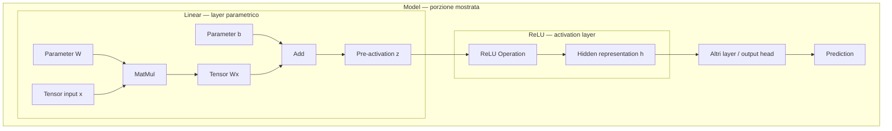
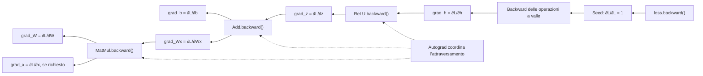
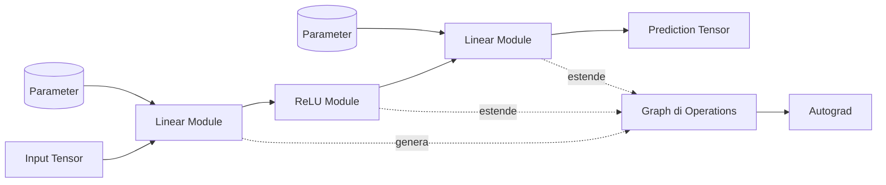

# 02 — Dal Tensor al grafo computazionale

## Scopo e posizione nella mappa

MyTorch non nasce per costruire direttamente reti neurali. Il suo primo compito è fornire un motore capace di rappresentare valori, trasformarli, conservare la storia delle trasformazioni e propagare gradienti.

Questo capitolo attraversa due livelli architetturali:

```text
CORE COMPUTAZIONALE
Tensor → Operation → Computational Graph → Autograd

COMPOSIZIONE DEL MODELLO
Parameter → Module → Linear → Neural Network
```

Il primo livello rende possibile il calcolo differenziabile; il secondo usa quel meccanismo per organizzare quantità apprendibili e costruire un modello. La mappa è spaziale, non temporale: per ogni oggetto ci chiediamo da cosa dipende, che responsabilità possiede e chi dipende da esso.

Il training loop rimane fuori dal confine principale del capitolo:

```text
Prediction → Loss → Backward → Gradients → Optimizer → Parameter Update
```

Ne incontreremo alcuni elementi per verificare che l'architettura funzioni, senza confonderli con il modello.

### Zoom out: quale parte della rete stiamo costruendo

Nel capitolo 1 la rete è apparsa come:

```text
Input → Layer → Rappresentazione nascosta → Layer → Prediction
```

Ora ingrandiamo ciò che avviene **dentro e sotto ogni freccia**. Quando un layer trasforma una rappresentazione, non manipola simboli astratti: riceve `Tensor`, applica `Operation` e produce nuovi `Tensor`. La sequenza delle operazioni forma il grafo che Autograd percorrerà.

```text
VISTA DELLA RETE
Input ─────→ Layer ─────→ Hidden

ZOOM NEL LAYER
Tensor → MatMul → Tensor → Add → Tensor → ReLU → Tensor
          ↑                ↑
       Parameter        Parameter
```

Il capitolo attraversa quindi due sottosistemi collegati:

```text
INFRASTRUTTURA DI ESECUZIONE
Tensor → Operation → Graph → Autograd
                ↓ sostiene
STRUTTURA DELLA RETE
Parameter → Module / Layer → Model
```

Il deep dive deve rispondere a una domanda precisa: **come può una gerarchia di layer diventare una computazione differenziabile senza assegnare a ogni layer un sistema di gradienti separato?**

### Diagramma del sottosistema

Il sottosistema viene mostrato in due versi separati. Il primo diagramma descrive il **forward**: parte dai valori disponibili, esegue le `Operation` e produce una rappresentazione nascosta. Il secondo descrive il **backward**: parte dal gradiente ricevuto da valle e attraversa in senso inverso il grafo costruito dal forward.

#### Forward: dai valori alla rappresentazione



Il diagramma mette a fuoco il blocco `Linear → ReLU`, composto da due layer con ruoli differenti. `Linear` è un layer parametrico: possiede `W` e `b` e il suo `forward()` compone `MatMul` e `Add`. `ReLU` è un activation layer senza parametri: il suo `forward()` applica la `ReLU Operation` alla pre-attivazione `z`. Il resto del modello è abbreviato perché non appartiene al deep dive corrente.

Durante questo percorso ogni `Operation` collega il Tensor prodotto all'operazione che lo ha creato e conserva i propri Tensor di input. Il forward produce quindi contemporaneamente valori e storia della computazione:

```text
VALORI PRODOTTI
x, W, b → Wx → z → h

LEGAMI REGISTRATI
output.creator → Operation
Operation.inputs → Tensor ricevuti
```

Da questi legami emerge il grafo computazionale che Autograd userà nel verso opposto.

#### Backward: dal gradiente a valle ai gradienti degli input



Il calcolo dei gradienti non avviene durante il forward. Dopo che il modello ha prodotto la prediction, una **loss** — una quantità scalare che misura il risultato rispetto all'obiettivo — prolunga il grafo a valle del modello. I gradienti vengono calcolati quando il programma invoca:

```python
# Avvia Autograd dal Tensor scalare che rappresenta la loss.
loss.backward()
```

La chiamata inizializza il gradiente della loss rispetto a se stessa con

```text
∂L/∂L = 1
```

e avvia Autograd. Le operazioni collocate tra la loss e `h` producono `∂L/∂h`; questo è il `grad_h` con cui il diagramma entra nel blocco `ReLU → Linear`. Non è quindi un gradiente scelto arbitrariamente: è il risultato del backward della parte di grafo situata a valle.

Da quel punto Autograd segue i legami registrati durante il forward e chiama, nell'ordine inverso, il `backward()` delle `Operation`:

1. ogni `backward()` riceve il gradiente della loss rispetto al proprio output, detto `grad_output`;
2. lo combina con la derivata locale dell'operazione mediante la chain rule;
3. restituisce un gradiente per ciascun Tensor di input;
4. Autograd propaga questi risultati all'operazione precedente;
5. quando un Tensor con `requires_grad=True` riceve un contributo, questo viene accumulato nel suo attributo `.grad`.

Nel blocco mostrato, `ReLU.backward()` trasforma `∂L/∂h` in `∂L/∂z`; `Add.backward()` produce il contributo per `b` e quello diretto verso `Wx`; `MatMul.backward()` produce infine i gradienti di `W` e, se `x.requires_grad=True`, di `x`. Qui non vengono ricalcolati i valori del forward e i layer non implementano un secondo sistema di differenziazione: il calcolo è affidato ai backward locali delle `Operation`, coordinati da Autograd.

Gli ingredienti messi a fuoco nei due diagrammi sono:

1. **Tensor di input** — porta nella computazione la rappresentazione ricevuta dal layer.
2. **Parameter** — sono Tensor posseduti dal modello; qui rappresentano peso e bias.
3. **Operation** — applica una trasformazione locale e conosce la propria regola di backward.
4. **Tensor intermedio** — contiene il risultato di un'operazione e il collegamento al proprio `creator`.
5. **Computational Graph** — non è un contenitore centrale: emerge durante il forward dai legami tra Tensor e Operation.
6. **Autograd** — nel backward percorre quei legami in senso inverso e coordina la composizione delle derivate locali.
7. **`Linear` Module / layer** — possiede `weight` e `bias`; il suo forward compone `MatMul` e `Add`.
8. **Activation layer `ReLU`** — è un `Module` senza Parameter; il suo forward applica la `ReLU Operation` alla pre-attivazione.
9. **Model** — contiene e compone i due layer con i componenti successivi, stabilendo il percorso complessivo dall'input alla prediction.

Il primo diagramma mostra insieme l'organizzazione stabile dei `Module` e l'esecuzione che essa produce; il secondo conserva soltanto il grafo necessario a leggere il flusso dei gradienti. Il grafo computazionale emerge dall'esecuzione e non coincide con la gerarchia dei `Module`.

I confini da mantenere sono:

```text
DATI              Tensor di input e Tensor intermedi
STATO PERSISTENTE Parameter
CALCOLO           Operation eseguite durante il forward
STORIA            Computational Graph
DIFFERENZIAZIONE  Autograd e backward locali
ORGANIZZAZIONE    Model contenente i Module / layer
```

Il capitolo parte dagli ingredienti del core e mostra poi come il livello organizzativo di `Module`, layer e modello li componga senza sostituirli.

---

## 2.1 Tensor: il valore che attraversa il sistema

### Architettura

Un `Tensor` è l'oggetto che fluisce attraverso tutto il motore:

```text
Tensor → Operation → Tensor → Operation → Tensor
```

Un array contiene valori. Un `Tensor` di MyTorch contiene valori e il contesto minimo necessario al calcolo differenziabile:

- `data`: scalare o liste annidate di valori numerici;
- `shape`: interpretazione dimensionale dei dati;
- `requires_grad`: indica se il gradiente deve essere propagato;
- `grad`: gradiente accumulato rispetto alla quantità scalare finale;
- `creator`: operazione che ha prodotto il tensore, oppure `None` per un tensore foglia.

Nel codice attuale non esistono ancora storage lineare e stride espliciti: `data` usa scalari e liste Python annidate. È una scelta di implementazione temporanea, non una diversa definizione architetturale di tensore.

### Implementazione

In [`mytorch/tensor.py`](../mytorch/tensor.py), il costruttore materializza esattamente questo stato:

```python
class Tensor:
    """Trasporta dati e stato necessario al calcolo differenziabile."""

    def __init__(self, data, requires_grad=False):
        """Crea un Tensor foglia da dati numerici Python."""
        # Lo stato del grafo è vuoto finché nessuna Operation produce il Tensor.
        self.data = data
        self.shape = _infer_shape(data)
        self.requires_grad = requires_grad
        self.grad = None
        self.creator = None
```

Gli operatori del `Tensor` non implementano direttamente l'algebra. Delegano alle corrispondenti `Operation`:

```python
def __mul__(self, other):
    """Delega la moltiplicazione element-wise a Multiply."""
    # Tensor espone l'operatore, ma il calcolo appartiene all'Operation.
    from .operations import Multiply
    return Multiply()(self, other)

def __matmul__(self, other):
    """Delega il prodotto tensoriale a MatMul."""
    # La delega mantiene separati trasporto dei dati e algebra differenziabile.
    from .operations import MatMul
    return MatMul()(self, other)
```

Questo dettaglio rende visibile la separazione delle responsabilità: `Tensor` trasporta stato, `Operation` esegue e registra una trasformazione.

### Esempio d'uso: osservare lo stato di un Tensor

```python
from mytorch import Tensor

# Creiamo un Tensor foglia per osservarne lo stato iniziale.
x = Tensor(
    [[1.0, 2.0], [3.0, 4.0]],
    requires_grad=True,
)

# Rendiamo visibili dati, shape e metadati differenziabili.
print(x.data)
print(x.shape)
print(x.requires_grad)
print(x.grad)
print(x.creator)
```

Output:

```text
[[1.0, 2.0], [3.0, 4.0]]
(2, 2)
True
None
None
```

`x` è un Tensor foglia: è stato creato direttamente dal programma, quindi non possiede un `creator`. Richiede il gradiente, ma `.grad` rimane `None` finché non viene eseguito un backward da uno scalare che dipende da `x`.

### Matematica

Se chiamiamo `L` lo scalare da cui parte la retropropagazione, il campo `x.grad` rappresenta

```text
∂L / ∂x
```

Non è una proprietà isolata di `x`: dipende dal percorso che collega `x` a `L` nel grafo.

---

## 2.2 Operation: una trasformazione con memoria locale

### Architettura

Una `Operation` riceve uno o più tensori, calcola nuovi dati e restituisce un nuovo tensore:

```text
Tensor di input
      ↓
   Operation
      ↓
Tensor di output
```

Oltre al calcolo numerico, conserva ciò che servirà durante il backward. L'interfaccia comune vive in [`mytorch/operations.py`](../mytorch/operations.py):

```python
class Operation:
    """Definisce il protocollo comune delle trasformazioni differenziabili."""

    def __call__(self, *inputs):
        """Esegue il forward e collega l'output al grafo."""
        # Gli input conservati serviranno alla regola locale di backward.
        self.inputs = inputs
        data = self.forward(*inputs)

        requires_grad = any(tensor.requires_grad for tensor in inputs)

        # creator registra quale Operation ha prodotto il nuovo Tensor.
        result = Tensor(data, requires_grad=requires_grad)
        result.creator = self
        self.output = result

        return result
```

La chiamata svolge quattro operazioni architetturali:

1. conserva i tensori di input;
2. delega il calcolo locale a `forward()`;
3. crea il tensore di output;
4. collega l'output all'operazione mediante `creator`.

`forward()` e `backward()` hanno responsabilità diverse:

```python
def forward(self, *inputs):
    """Calcola i dati di output a partire dai Tensor ricevuti."""
    # Ogni Operation concreta deve fornire la propria trasformazione.
    raise NotImplementedError

def backward(self, grad_output):
    """Restituisce un gradiente locale per ciascun Tensor di input."""
    # La regola concreta combina grad_output con la derivata locale.
    raise NotImplementedError
```

Il primo calcola valori; il secondo applica la regola differenziale locale.

### Esempio d'uso: un'Operation costruisce un collegamento

```python
from mytorch import Tensor

# I due Tensor foglia richiedono entrambi il gradiente.
a = Tensor([2.0, 3.0], requires_grad=True)
b = Tensor([4.0, 5.0], requires_grad=True)

# L'operatore costruisce ed esegue una Multiply Operation.
z = a * b

# Ispezioniamo sia il risultato sia i legami registrati nel grafo.
print(z.data)
print(z.shape)
print(type(z.creator).__name__)
print(z.creator.inputs[0] is a)
print(z.creator.inputs[1] is b)
```

Output:

```text
[8.0, 15.0]
(2,)
Multiply
True
True
```

L'espressione `a * b` invoca `Multiply`: l'Operation produce i valori di `z`, diventa il suo `creator` e conserva riferimenti proprio ai Tensor `a` e `b`. Questi riferimenti sono la memoria locale che renderà possibile il backward.

### Esempio: moltiplicazione

Per `z = a * b`, la matematica locale è:

```text
∂z/∂a = b
∂z/∂b = a
```

Queste sono le derivate di `z` rispetto ai suoi input, ma non sono ancora i gradienti che interessano al training. Se una loss scalare `L` dipende da `z`, vogliamo calcolare:

```text
∂L/∂a
∂L/∂b
```

La chain rule fornisce:

```text
∂L/∂a = (∂L/∂z)(∂z/∂a) = (∂L/∂z)b
∂L/∂b = (∂L/∂z)(∂z/∂b) = (∂L/∂z)a
```

Nell'interfaccia di MyTorch:

```text
grad_output = ∂L/∂z
```

Di conseguenza, `Multiply.backward()` non restituisce semplicemente `b` e `a`. Combina il gradiente ricevuto da valle con le derivate locali:

```python
class Multiply(Operation):
    """Implementa la moltiplicazione element-wise differenziabile."""

    def backward(self, grad_output):
        """Propaga grad_output ai due operandi della moltiplicazione."""
        a, b = self.inputs

        output_shape = self.output.shape

        # Combiniamo il gradiente da valle con le due derivate locali.
        grad_a_full = _broadcast_binary(
            grad_output, output_shape,
            b.data, b.shape,
            lambda g, y: g * y,
        )
        grad_b_full = _broadcast_binary(
            grad_output, output_shape,
            a.data, a.shape,
            lambda g, x: g * x,
        )

        # Riduciamo gli assi eventualmente introdotti dal broadcasting.
        grad_a = _reduce_broadcast_gradient(
            grad_a_full, output_shape, a.shape
        )
        grad_b = _reduce_broadcast_gradient(
            grad_b_full, output_shape, b.shape
        )

        return grad_a, grad_b
```

La riduzione finale serve quando uno degli input è stato riutilizzato mediante broadcasting; questo meccanismo sarà analizzato nel capitolo 4. Senza broadcasting, `grad_a_full` e `grad_b_full` hanno già le shape corrette.

L'operazione non conosce l'intero modello né la formula completa della loss. Riceve da valle l'effetto della parte successiva del grafo e conosce la propria trasformazione locale. Queste due informazioni sono sufficienti.

---

## 2.3 Il grafo computazionale emerge dalle relazioni

### Architettura

MyTorch non possiede un oggetto centrale `Graph`. Il grafo è distribuito tra:

- il `creator` conservato da ogni tensore prodotto;
- gli `inputs` conservati da ogni operazione.

Nel diagramma introduttivo `loss` indicava il Tensor scalare da cui viene chiamato `loss.backward()`. Da questo punto in poi useremo `L` come simbolo matematico per quella stessa quantità:

```text
loss    nome del Tensor nel codice
L       simbolo matematico del suo valore scalare
```

Nel seguente esempio la variabile `loss` rappresenta dunque `L`:

```python
from mytorch import Tensor

# Costruiamo un grafo Multiply → Sum che termina in una loss scalare.
a = Tensor([2.0, 3.0], requires_grad=True)
b = Tensor([4.0, 5.0], requires_grad=True)
loss = (a * b).sum()

# Risaliamo dai collegamenti creator/inputs senza un oggetto Graph centrale.
multiply = loss.creator.inputs[0].creator

print(type(loss.creator).__name__)
print(type(multiply).__name__)
print(multiply.inputs[0] is a)
print(multiply.inputs[1] is b)
```

Output:

```text
Sum
Multiply
True
True
```

I collegamenti osservati corrispondono alla struttura costruita dinamicamente:

```text
a ─┐
   ├→ Multiply → risultato intermedio → Sum → loss
b ─┘
```

Il forward costruisce il grafo mentre esegue il calcolo. Non è necessaria una fase separata di dichiarazione.

### Perché il grafo è necessario

Il valore di `loss` non contiene da solo informazioni sufficienti per ricostruire come dipende da `a` e `b`. I collegamenti tra tensori e operazioni preservano la storia causale del calcolo. Autograd usa quella storia in direzione inversa.

Questa distinzione è importante:

```text
forward   produce valori e costruisce il grafo
backward  percorre il grafo e produce gradienti
```

---

## 2.4 Autograd: composizione delle derivate locali

### Matematica

Se

```text
x → f → y → g → L
```

la chain rule fornisce

```text
∂L/∂x = (∂L/∂y)(∂y/∂x)
```

Ogni `Operation` calcola il proprio fattore locale. Autograd coordina la loro composizione lungo il grafo.

### Derivata locale e gradiente non sono la stessa cosa

Consideriamo:

```text
a = [2, 3]
b = [4, 5]
z = a * b = [8, 15]
L = z.sum() = 23
```

Il grafo è:

```text
a ─┐
   ├→ Multiply → z → Sum → L
b ─┘
```

La derivata locale di `Multiply` rispetto ad `a` è `b`:

```text
∂z/∂a = [4, 5]
```

Il backward, però, parte dalla loss. `Sum.backward()` comunica a `Multiply`:

```text
grad_output = ∂L/∂z = [1, 1]
```

`Multiply.backward()` compone le due informazioni:

```text
∂L/∂a = grad_output * b
       = [1, 1] * [4, 5]
       = [4, 5]

∂L/∂b = grad_output * a
       = [1, 1] * [2, 3]
       = [2, 3]
```

In questo esempio il gradiente rispetto ad `a` coincide numericamente con `b` soltanto perché `Sum` invia un vettore di `1`.

Se invece:

```text
L = sum(z²)
```

allora l'operazione `Power` invia:

```text
grad_output = ∂L/∂z = 2z
```

e `Multiply.backward()` restituisce:

```text
∂L/∂a = (2z)b
∂L/∂b = (2z)a
```

La distinzione generale è:

```text
derivata locale
    descrive come l'output dell'Operation cambia rispetto a un input

grad_output
    descrive come la loss cambia rispetto all'output dell'Operation

grad_input
    combina le due informazioni mediante la chain rule
```

In forma compatta:

```text
grad_input = grad_output × derivata locale
```

Per tensori multidimensionali questa espressione rappresenta, più precisamente, un prodotto vettore-Jacobiana. MyTorch non costruisce la Jacobiana completa: ogni `backward()` calcola direttamente il suo effetto sul gradiente ricevuto. È questa scelta che rende praticabile la reverse-mode autodiff.

### Implementazione

Nel codice attuale il coordinamento è ricorsivo e risiede in `Tensor.backward()`:

```python
def backward(self, grad=None):
    """Accumula il gradiente e lo propaga ricorsivamente verso gli input."""
    # I Tensor esclusi dalla differenziazione interrompono questo ramo.
    if not self.requires_grad:
        return

    if grad is None:
        if self.shape != ():
            raise RuntimeError(
                "backward() without an explicit grad is allowed only "
                "for scalar tensors."
            )
        grad = 1.0

    # Più percorsi del grafo possono contribuire allo stesso Tensor.
    self._accumulate_grad(grad)

    if self.creator is None:
        return

    # La Operation creatrice applica la propria regola differenziale locale.
    input_grads = self.creator.backward(grad)

    for tensor, tensor_grad in zip(self.creator.inputs, input_grads):
        if tensor.requires_grad:
            tensor.backward(tensor_grad)
```

La chiamata senza argomento è ammessa solo su uno scalare e semina il backward con `1.0`, perché

```text
∂L/∂L = 1
```

### Accumulazione dei gradienti

Un tensore può contribuire alla stessa loss attraverso più rami. Per esempio:

```python
from mytorch import Tensor

# x entra due volte nello stesso ramo Add del grafo.
x = Tensor([2.0, 3.0], requires_grad=True)
y = x + x
loss = y.sum()

# Prima del backward il valore esiste, ma x.grad è ancora vuoto.
print(loss.data)
print(x.grad)

# Autograd parte dal seed scalare e accumula entrambi i contributi.
loss.backward()

print(loss.grad)
print(x.grad)
```

Output:

```text
10.0
None
1.0
[2.0, 2.0]
```

Prima di `loss.backward()` nessun gradiente è stato calcolato. La chiamata assegna alla loss il seed `1.0` e percorre il grafo. Ogni elemento di `x` contribuisce alla loss attraverso due rami, quindi `x.grad == [2.0, 2.0]`. Per questo `_accumulate_grad()` somma i contributi invece di sovrascriverli.

### Limite attuale

Il backward ricorsivo è sufficiente per il laboratorio corrente, ma non implementa ancora un ordinamento topologico esplicito. Questa limitazione appartiene all'implementazione di Autograd, non alla sua responsabilità architetturale.

---

## 2.5 Cambio di livello: dal calcolo al modello

Fin qui abbiamo parlato del **core computazionale**. Il core sa rappresentare valori, applicare trasformazioni e calcolare gradienti, ma non possiede ancora il concetto di modello.

Dal suo punto di vista, questi oggetti sono tutti tensori:

```text
input
valore intermedio
peso
bias
prediction
```

Le operazioni non devono sapere quale ruolo ricopra ciascun tensore. `MatMul`, per esempio, applica la stessa regola numerica e differenziale sia che un operando rappresenti dati osservati sia che rappresenti pesi apprendibili.

Questa neutralità è una proprietà desiderata del core, ma lascia aperte nuove domande:

```text
Quali valori devono essere modificati durante il training?
A quale componente appartengono?
Come possiamo recuperarli senza elencarli manualmente?
Come componiamo più trasformazioni in un unico modello?
```

Per rispondere non serve aggiungere una nuova algebra. Serve cambiare livello di astrazione e attribuire **semantica**, **ownership** e **struttura** agli oggetti già differenziabili.

```text
CORE COMPUTAZIONALE        COMPOSIZIONE DEL MODELLO
Tensor → Operation   →     Parameter → Module → Model
```

La freccia tra i due livelli non indica che `Parameter` sostituisca `Tensor`. Indica una specializzazione:

```text
Tensor
  valore che può partecipare al calcolo differenziabile
        ↓ specializzazione semantica
Parameter
  Tensor che appartiene allo stato apprendibile
        ↓ organizzazione
Module
  componente che possiede Parameter e definisce un forward
        ↓ composizione
Model
  gerarchia di Module che produce una prediction
```

Il livello superiore riusa integralmente quello inferiore. I `Parameter` attraversano le stesse `Operation`, il grafo emerge nello stesso modo e Autograd applica le stesse regole locali. Cambia il significato attribuito ad alcuni tensori e il modo in cui vengono organizzati.

Questo è quindi un cambio dall'astrazione **“come si calcola e si differenzia?”** all'astrazione **“quali valori costituiscono il modello e come sono composti?”**.

---

## 2.6 Parameter: un Tensor con semantica apprendibile

Supponiamo di costruire una trasformazione affine usando tre tensori:

```text
y = W x + b
```

Per il core computazionale, `W`, `x` e `b` sono operandi. Durante il training, però, hanno ruoli differenti:

```text
x        dato fornito al modello
W, b     stato interno che il modello deve apprendere
y        risultato temporaneo del forward
```

Autograd può calcolare gradienti rispetto a tutti gli oggetti per cui `requires_grad=True`, ma questo flag risponde soltanto alla domanda:

```text
“devo propagare e conservare il gradiente per questo Tensor?”
```

Non risponde alla domanda:

```text
“questo Tensor fa parte dello stato che l'optimizer deve aggiornare?”
```

Un input può richiedere il gradiente, per esempio per studiare la sensibilità della prediction rispetto ai dati, costruire metodi di interpretabilità o ottimizzare direttamente un input. Ciò non lo trasforma in un peso del modello.

```python
# Questo input richiede sensibilità, ma non appartiene allo stato del modello.
x = Tensor([2.0], requires_grad=True)
```

Qui `x.grad` verrà calcolato, ma `x` non dovrebbe comparire automaticamente in `model.parameters()`.

`Parameter` introduce precisamente la semantica mancante: identifica un tensore come parte persistente e apprendibile del modello.

```text
requires_grad=True
    richiede il calcolo del gradiente

isinstance(value, Parameter)
    identifica lo stato apprendibile posseduto dal modello
```

### Architettura

Un `Parameter` è un `Tensor` che appartiene allo stato apprendibile di un modello. La differenza è semantica, non numerica: pesi e bias partecipano alle stesse operazioni degli altri tensori, ma devono essere trovati dal modello ed esposti all'ottimizzatore.

La relazione è:

```text
ogni Parameter è un Tensor
non ogni Tensor è un Parameter
```

Essendo un `Tensor`, un `Parameter` possiede `data`, `shape`, `grad`, `requires_grad` e `creator`, e può partecipare a tutte le operazioni già implementate. Non richiede una rappresentazione numerica separata né un sistema di Autograd speciale.

Normalmente un parametro è anche un tensore foglia:

```text
parameter.creator = None
```

Non è prodotto dal forward corrente: esiste già prima del forward e viene usato per costruirlo. Il gradiente raggiunge questa foglia percorrendo a ritroso le operazioni che dipendono da essa.

Essere una foglia non è però sufficiente a renderlo un parametro. Anche `x` e `target` possono essere tensori foglia. Ancora una volta, la distinzione è il ruolo architetturale.

### Implementazione

[`mytorch/parameter.py`](../mytorch/parameter.py) rende esplicita questa relazione mediante ereditarietà:

```python
class Parameter(Tensor):
    """Rappresenta un Tensor appartenente allo stato apprendibile."""

    def __init__(self, data):
        """Crea un Tensor foglia che richiede sempre il gradiente."""
        # La specializzazione è semantica: dati e Autograd restano quelli di Tensor.
        super().__init__(data, requires_grad=True)
```

### Esempio d'uso: distinguere stato apprendibile e input

```python
from mytorch import Parameter, Tensor

# weight è stato del modello; x è un normale input differenziabile.
weight = Parameter([2.0, -1.0])
x = Tensor([3.0, 4.0], requires_grad=True)
loss = (weight * x).sum()

# Prima del backward osserviamo tipo, flag e natura di foglia.
print(isinstance(weight, Tensor))
print(weight.requires_grad)
print(weight.creator)

# Entrambi ricevono gradienti perché entrambi hanno requires_grad=True.
loss.backward()

print(weight.grad)
print(x.grad)
```

Output:

```text
True
True
None
[3.0, 4.0]
[2.0, -1.0]
```

`weight` e `x` partecipano alle stesse `Operation` e ricevono entrambi un gradiente. Soltanto `weight`, però, è un `Parameter`: il suo tipo dichiara che quel Tensor può appartenere allo stato apprendibile di un modello. `creator` è `None` perché il Parameter esiste prima del forward ed è una foglia del grafo.

`requires_grad=True` è necessario, ma non esaurisce il significato di `Parameter`. Un normale input può richiedere il gradiente senza essere parte dello stato apprendibile. Il tipo `Parameter` permette a `Module` di riconoscere ciò che appartiene al modello.

Durante il training, i diversi aspetti del parametro cambiano in momenti differenti:

```text
creazione
    data contiene il valore iniziale
    grad è None

forward
    data viene letta dalle Operations

backward
    grad accumula ∂loss/∂parameter
    data non cambia

optimizer.step()
    data viene aggiornata usando grad

zero_grad()
    grad torna a None
    data conserva il valore aggiornato
```

Il `Parameter` mantiene la propria identità come oggetto posseduto dal modello mentre il suo stato numerico evolve. Questo permette al `Module` e all'optimizer di conservare riferimenti allo stesso oggetto senza doverlo riscoprire dopo ogni aggiornamento.

---

## 2.7 Module: contratto e ownership

Con `Parameter` abbiamo distinto i tensori apprendibili dagli altri tensori, ma non abbiamo ancora stabilito **a quale componente appartengano** né come recuperarli quando il modello cresce.

In un modello reale, mantenere manualmente una lista separata di pesi e bias sarebbe fragile:

```text
weight_1, bias_1, weight_2, bias_2, ...
```

Ogni nuova parte del modello obbligherebbe il training loop, l'optimizer e gli strumenti di salvataggio a conoscere la sua struttura interna. Il problema non è matematico: Autograd sa già calcolare i gradienti. È un problema di organizzazione dello stato e delle responsabilità.

`Module` introduce la risposta architetturale:

```text
Parameter
    stabilisce che un Tensor è apprendibile

Module
    stabilisce chi possiede quel Parameter
    e quale calcolo viene eseguito con esso
```

Un modulo costituisce quindi un confine software attorno a stato e comportamento correlati. A questo punto osserviamo il caso più semplice: un componente che possiede direttamente un `Parameter` e definisce il calcolo che lo usa. La composizione di un `Module` dentro un altro verrà introdotta nella sezione 2.9, dopo avere costruito i primi layer concreti.

### Relazione tra Module e layer

`Module` è una classe base, non una trasformazione già utilizzabile. Il suo metodo `forward()` non conosce alcun calcolo e solleva `NotImplementedError`: chiamare direttamente un'istanza di `Module` non può quindi produrre un Tensor.

```text
Module
  definisce il contratto __call__() → forward()
        ↓ richiede una sottoclasse
Module concreto
  implementa forward() e può possedere Parameter
```

Un layer di MyTorch sarà dunque un `Module` concreto che trasforma una rappresentazione. La relazione non è però un'identità:

```text
ogni layer di MyTorch è un Module
non ogni Module è necessariamente un singolo layer
```

La sezione 2.8 concretizzerà questo contratto con `Linear`. Solo dopo sarà possibile mostrare senza salti come più `Module` formino un modello.

### Architettura

Un `Module` organizza:

```text
Module
├── Parameter posseduti direttamente
└── forward()
```

Non introduce una nuova primitiva matematica. Introduce ownership e un'interfaccia uniforme per il forward. La capacità di contenere altri `Module` appartiene allo stesso contratto, ma diventerà osservabile nella composizione ricorsiva della sezione 2.9.

### Implementazione

In [`mytorch/module.py`](../mytorch/module.py), `__call__` rende un modulo invocabile e `parameters()` attraversa ricorsivamente la gerarchia:

```python
class Module:
    """Definisce il contratto base dei componenti di un modello."""

    def __call__(self, *inputs):
        """Inoltra l'invocazione pubblica al forward concreto."""
        # La classe base uniforma la chiamata di layer, blocchi e modelli.
        return self.forward(*inputs)

    def forward(self, *inputs):
        """Definisce il calcolo nelle sottoclassi concrete."""
        # Module non è utilizzabile finché una sottoclasse non implementa il forward.
        raise NotImplementedError

    def parameters(self):
        """Restituisce ricorsivamente i Parameter posseduti dal componente."""
        params = []

        # Gli attributi possono essere Parameter diretti o Module annidati.
        for value in self.__dict__.values():
            if isinstance(value, Parameter):
                params.append(value)
            elif isinstance(value, Module):
                params.extend(value.parameters())

        return params
```

`__call__()` stabilisce il percorso uniforme di invocazione, ma delega il calcolo a `forward()`. La classe base lascia intenzionalmente quest'ultimo indefinito. `parameters()` contiene già anche il ramo ricorsivo per i `Module` annidati; in questa sezione usiamo soltanto il caso diretto, mentre la ricorsione verrà osservata in 2.9.

### Esempio d'uso: rendere concreto il contratto

```python
from mytorch import Module, Parameter, Tensor

class Scale(Module):
    """Moltiplica l'input per un unico fattore apprendibile."""

    def __init__(self, value):
        """Registra value come Parameter posseduto dal componente."""
        self.factor = Parameter(value)

    def forward(self, x):
        """Applica il fattore tramite una Multiply Operation."""
        return x * self.factor

# Rendiamo concreto il contratto Module e invochiamo il forward.
scale = Scale(2.0)
x = Tensor([1.5, -2.0, 3.0])
output = scale(x)
parameters = scale.parameters()

# Osserviamo risultato, grafo e Parameter scoperto dal Module.
print(output.data)
print(type(output.creator).__name__)
print(len(parameters))
print(parameters[0] is scale.factor)
```

Output:

```text
[3.0, -4.0, 6.0]
Multiply
1
True
```

`Scale` rende concreto il contratto astratto: possiede direttamente il `Parameter factor` e implementa `forward()` componendo una `Multiply Operation`. La chiamata `scale(x)` passa attraverso `Module.__call__()`, raggiunge `Scale.forward()` e produce un Tensor collegato al grafo. `parameters()` trova il `Parameter` posseduto direttamente dal componente.

L'esempio non introduce ancora né un layer standard né una gerarchia di sottomoduli. Mostra soltanto il passaggio indispensabile:

```text
Module astratto
    ↓ sottoclasse + forward concreto
componente invocabile e differenziabile
```

Il meccanismo corrente scopre parametri e sottomoduli assegnati direttamente come attributi. Contenitori generici, liste di moduli, serializzazione e gestione dello stato non sono ancora implementati.

---

## 2.8 Linear: una struttura costruita con primitive esistenti

`Module` definisce come organizzare un componente, ma non specifica quale trasformazione debba eseguire. **`Linear` implementa un layer come sottoclasse concreta di `Module`**: assegna una precisa interpretazione matematica al contratto generico `forward()` e possiede i `Parameter` necessari a realizzarlo.

Il passaggio può essere letto così:

```text
Module
  fornisce contratto, ownership e interfaccia
        ↓
Linear : Module
  implementa un layer
  sceglie una trasformazione affine
  e la costruisce con Operations esistenti
```

`Linear` collega due spazi di rappresentazione. Riceve un certo numero di componenti, ne costruisce combinazioni pesate e produce un nuovo numero di componenti. I coefficienti di queste combinazioni non sono fissati nel codice: sono `Parameter` appresi durante il training.

Per ogni componente di output, il layer calcola una diversa combinazione di tutti gli input:

```text
input x₀ ─┬────────→ output y₀
input x₁ ─┼────────→ output y₁
input x₂ ─┴────────→ output y₂

ogni collegamento possiede un peso apprendibile
ogni output possiede inoltre un bias apprendibile
```

Il nome storico `Linear` richiede una precisazione: con il bias, la trasformazione `Wx + b` è matematicamente **affine**, non strettamente lineare. I framework mantengono comunque il nome `Linear` per questo tipo di layer.

Dal punto di vista di MyTorch, l'aspetto decisivo è che `Linear` non aggiunge una nuova primitiva al core computazionale. Compone oggetti già disponibili:

```text
Parameter weight
Parameter bias
Tensor input
Operation MatMul
Operation Add
```

In questo modo il layer ottiene automaticamente costruzione del grafo e backward dalle operazioni sottostanti. `Linear` decide **quale calcolo comporre**; non reimplementa **come differenziarlo**.

### Matematica

Per un vettore di input `x`, un layer `Linear` applica una trasformazione affine:

```text
y = W x + b
```

I due argomenti del costruttore specificano il contratto tra lo spazio di ingresso e quello di uscita:

```python
# Firma pubblica: il layer mappa in_features componenti in out_features.
Linear(in_features, out_features)
```

```text
in_features
    numero di componenti che il layer deve ricevere

out_features
    numero di componenti che il layer deve produrre
```

Per il caso a singolo esempio analizzato in questo capitolo, le shape sono:

```text
x : (in_features,)
W : (out_features, in_features)
b : (out_features,)
y : (out_features,)
```

Ogni riga di `W` contiene i pesi di una componente di output. Per esempio:

```text
Linear(3, 2)

x.shape      = (3,)
weight.shape = (2, 3)
bias.shape   = (2,)
y.shape      = (2,)
```

Esplicitamente:

```text
y₀ = W₀₀x₀ + W₀₁x₁ + W₀₂x₂ + b₀
y₁ = W₁₀x₀ + W₁₁x₁ + W₁₂x₂ + b₁
```

Il layer trasforma quindi un punto di uno spazio a tre componenti in un punto di uno spazio a due componenti. Non esiste alcun requisito per cui `in_features` e `out_features` debbano coincidere: cambiare dimensionalità è precisamente una delle funzioni del layer.

La compatibilità richiesta è interna alla moltiplicazione:

```text
W.shape = (2, 3)
x.shape =    (3,)
                    ↑
        queste dimensioni devono coincidere
```

La dimensione condivisa viene contratta dalla somma di `MatMul`; rimane la dimensione delle righe di `W`, cioè `out_features`.

### Architettura e implementazione

`Linear` è un `Module` che possiede due `Parameter` e compone `MatMul` con `Add`. Il codice reale in [`mytorch/layers.py`](../mytorch/layers.py) è:

```python
class Linear(Module):
    """Applica una trasformazione affine a vettori o batch di vettori."""

    def __init__(self, in_features, out_features):
        """Crea weight e bias con shape determinate dal contratto del layer."""
        self.in_features = in_features
        self.out_features = out_features
        # ... inizializzazione editoriale omessa: il repository crea valori casuali ...
        self.weight = Parameter(weights)
        self.bias = Parameter(biases)

    def forward(self, x):
        """Calcola Wx+b per un vettore o xW^T+b per un batch row-wise."""
        # Il ramo vettoriale è quello sviluppato matematicamente nel capitolo.
        if x.shape == (self.in_features,):
            return self.weight @ x + self.bias

        # Il codice corrente accetta anche una matrice di esempi organizzati per righe.
        if len(x.shape) == 2 and x.shape[1] == self.in_features:
            return x @ self.weight.T + self.bias

        raise ValueError(
            "Linear expected input shape "
            f"({self.in_features},) or "
            f"(batch_size, {self.in_features}), "
            f"received {x.shape}."
        )
```

Nel grafo, l'ultima riga diventa:

```text
weight ─┐
        ├→ MatMul ─┐
input  ─┘          ├→ Add → output
bias ──────────────┘
```

`Linear` non implementa un proprio backward. Non ne ha bisogno: `MatMul` e `Add` hanno già le regole locali necessarie, e Autograd compone i gradienti. È il primo esempio completo del principio secondo cui strutture di livello superiore emergono componendo primitive inferiori.

### Esempio d'uso: forward e gradienti di un Linear

Per collocare l'esempio dentro una rete, interpretiamo `x` come la rappresentazione ricevuta da questo `Linear`. Se il layer è interno al modello, `x` è la **hidden representation** prodotta dal layer precedente per lo specifico input e per i valori correnti dei Parameter. Non la chiamiamo *hidden state*: questo termine indica normalmente lo stato trasmesso tra passi temporali in un'architettura ricorrente. La distinzione non è universale rispetto a ogni `Linear`: il primo layer può ricevere direttamente l'input del modello, mentre un output head può ricevere l'ultima hidden representation.

```python
from mytorch import Linear, Tensor

# Impostiamo valori deterministici per rendere verificabile il forward.
layer = Linear(3, 2)
layer.weight.data = [
    [0.5, 1.0, -2.0],
    [1.5, -1.0, 0.2],
]
layer.bias.data = [1.0, 2.0]

# Interpretiamo x come hidden representation prodotta dal layer precedente.
x = Tensor([2.0, 4.0, 1.0])

# Il Linear costruisce MatMul → Add e produce la rappresentazione successiva.
y = layer(x)

print(y.data)
print(y.shape)

# La somma scalare permette di osservare i gradienti dei Parameter.
y.sum().backward()

print(layer.weight.grad)
print(layer.bias.grad)
```

Output:

```text
[4.0, 1.2]
(2,)
[[2.0, 4.0, 1.0], [2.0, 4.0, 1.0]]
[1.0, 1.0]
```

In questa lettura, `x` è una hidden representation con tre componenti e `y` è il Tensor a due componenti prodotto dal layer. Se una funzione di attivazione segue il `Linear`, `y` ne costituisce la pre-attivazione. Il backward della somma raggiunge `weight` e `bias` attraverso `Add` e `MatMul`: il layer espone i gradienti nei propri `Parameter` pur non implementando un `Linear.backward()`.

### Le tre shape da non confondere

Quando si parla della “shape di un layer” si possono intendere tre cose differenti:

```text
shape dell'input       (in_features,)
shape dei pesi         (out_features, in_features)
shape dell'output      (out_features,)
```

Il `Module` in sé non è un tensore e quindi non possiede una singola `shape`. Possiede invece un contratto input-output e parametri con shape determinate da quel contratto.

---

## 2.9 Neural Network: composizione ricorsiva di Module

Ora conosciamo due `Module` concreti: `Linear`, introdotto nella sezione 2.8, e l'activation layer `ReLU`, anticipato nel diagramma iniziale e approfondito più avanti in questa sezione. Possiamo quindi affrontare la responsabilità lasciata in sospeso: comporre più `Module` senza perdere l'ownership dei loro `Parameter`.

Un `Module` può possedere altri `Module` come attributi. La relazione è ricorsiva: un componente composto espone la stessa interfaccia `forward()` dei componenti che contiene e `parameters()` scende nella gerarchia fino ai Parameter foglia.

```text
Model : Module
├── Layer : Module
│   ├── Parameter
│   └── Parameter
├── Activation : Module
└── Layer : Module
    ├── Parameter
    └── Parameter
```

Una rete neurale compare quando questi moduli vengono composti per produrre una prediction:

```text
Input → Linear → ReLU → Linear → Prediction
```

[`mytorch/main.py`](../mytorch/main.py) contiene un modello concreto:

```python
# Importiamo le astrazioni necessarie a definire la gerarchia del modello.
from mytorch import Linear, Module, ReLU


class TinyNet(Module):
    """Compone due Linear e una ReLU in una piccola rete feed-forward."""

    def __init__(self):
        """Registra i tre layer come sottomoduli del modello."""
        self.layer1 = Linear(1, 4)
        self.relu = ReLU()
        self.layer2 = Linear(4, 1)

    def forward(self, x):
        """Trasforma un input unidimensionale in una prediction scalare."""
        # Ogni chiamata a un sottomodulo estende il grafo del forward.
        x = self.layer1(x)
        x = self.relu(x)
        x = self.layer2(x)
        return x
```

### Esempio d'uso: eseguire il modello e osservarne lo stato

```python
from mytorch import Tensor

# Il modello possiede già la gerarchia; il forward crea il grafo dinamico.
model = TinyNet()
x = Tensor([2.0])
prediction = model(x)
parameters = model.parameters()

# Confrontiamo output dell'esecuzione e stato persistente scoperto ricorsivamente.
print(prediction.shape)
print(type(prediction.creator).__name__)
print(len(parameters))
print([parameter.shape for parameter in parameters])
```

Output:

```text
(1,)
Add
4
[(4, 1), (4,), (1, 4), (1,)]
```

La chiamata attraversa i tre sottomoduli e restituisce una prediction con la shape richiesta dall'ultimo `Linear`. Il suo `creator` è l'`Add` finale del secondo layer.

La lista delle shape rende osservabile la discesa ricorsiva di `model.parameters()`:

```text
TinyNet.parameters()
├── layer1.parameters() → weight (4, 1), bias (4,)
├── relu.parameters()   → nessun Parameter
└── layer2.parameters() → weight (1, 4), bias (1,)
```

L'optimizer può quindi ricevere `model.parameters()` senza conoscere nomi, numero o posizione dei singoli pesi.

Questa gerarchia non coincide con il grafo computazionale. La gerarchia dei moduli descrive la struttura relativamente stabile del modello e l'ownership dei parametri; il grafo computazionale descrive invece le operazioni effettivamente eseguite durante uno specifico forward.

```text
GERARCHIA DEI MODULE             GRAFO COMPUTAZIONALE
struttura del modello            storia di una computazione
possesso dei Parameter           legami Tensor ↔ Operation
esiste prima del forward         emerge durante il forward
```

### Perché i due `Linear` hanno shape differenti

In `TinyNet`, il primo layer espande la rappresentazione da una componente a quattro:

```text
layer1 = Linear(1, 4)

input.shape         = (1,)
layer1.weight.shape = (4, 1)
layer1.bias.shape   = (4,)
output.shape        = (4,)
```

Il secondo layer comprime la rappresentazione da quattro componenti a una:

```text
layer2 = Linear(4, 1)

input.shape         = (4,)
layer2.weight.shape = (1, 4)
layer2.bias.shape   = (1,)
output.shape        = (1,)
```

Le matrici dei pesi hanno dunque shape differenti:

```text
layer1.weight : (4, 1)
layer2.weight : (1, 4)
```

Non vengono moltiplicate direttamente tra loro. Ciascun layer moltiplica i propri pesi per il tensore che riceve. La composizione è valida perché l'output del primo ha la shape richiesta dall'input del secondo:

```text
Linear(1, 4) → output (4,) → input (4,) → Linear(4, 1)
                       shape di collegamento
```

La regola generale per comporre due layer è:

```text
Linear(n, h) → Linear(h, m)
          ↑              ↑
          └── dimensione di collegamento
```

I layer possono quindi avere matrici dei pesi differenti, ma l'interfaccia tra loro deve essere compatibile:

```text
out_features del layer precedente
                  =
in_features del layer successivo
```

Se scrivessimo invece:

```python
# Errore di composizione: layer2 richiede 3 componenti, ma layer1 ne produce 4.
self.layer1 = Linear(1, 4)
self.layer2 = Linear(3, 1)
```

il primo produrrebbe `(4,)`, mentre il secondo richiederebbe `(3,)`. Il controllo in `Linear.forward()` solleverebbe quindi un `ValueError`: non esiste una connessione dimensionale valida.

### Il ruolo di ReLU tra i due layer

`ReLU` significa **Rectified Linear Unit**, in italiano unità lineare rettificata. È una funzione di attivazione applicata indipendentemente a ogni elemento:

```text
ReLU(x) = max(0, x)
```

Intuitivamente agisce come una soglia:

```text
x < 0    → 0
x = 0    → 0
x > 0    → x
```

Per esempio:

```text
ReLU([-2, 0, 3, 5]) = [0, 0, 3, 5]
```

Si chiama “rettificata” perché elimina la parte negativa della funzione identità, lasciando invariata quella positiva. Non possiede `Parameter`: è un layer perché trasforma una rappresentazione, ma non contiene stato apprendibile.

### Dove si colloca nella rete

`ReLU` viene posta tra due layer affini:

```text
Linear → ReLU → Linear
```

Il primo `Linear` costruisce una rappresentazione intermedia. `ReLU` decide elemento per elemento quali componenti positive lasciare passare e quali componenti non positive annullare. Il secondo `Linear` combina la rappresentazione risultante.

`ReLU` non modifica la shape:

```text
(4,) → ReLU → (4,)
```

Modifica soltanto i valori, introducendo una non linearità. Il flusso completo delle shape è:

```text
input       Linear(1,4)       ReLU       Linear(4,1)    prediction
 (1,)  ─────────────────→     (4,)  ─────────────────→    (1,)
```

Più precisamente:

```text
(1,) → Linear(1,4) → (4,) → ReLU → (4,) → Linear(4,1) → (1,)
```

Senza ReLU, la composizione di due trasformazioni affini sarebbe ancora una singola trasformazione affine:

```text
W₂(W₁x + b₁) + b₂
= (W₂W₁)x + (W₂b₁ + b₂)
```

La rappresentazione intermedia a quattro componenti acquista capacità espressiva non lineare proprio perché `ReLU` viene applicata prima del secondo layer.

### Forward e backward

Il forward reale in [`mytorch/operations.py`](../mytorch/operations.py) applica la soglia elemento per elemento:

```python
class ReLU(Operation):
    """Applica la Rectified Linear Unit elemento per elemento."""

    def forward(self, x):
        """Azzera i valori negativi senza modificare la shape."""
        # _map_unary applica la soglia a ogni scalare annidato nel Tensor.
        return _map_unary(
            x.data,
            lambda value: max(0.0, value),
        )
```

Nel backward, la derivata locale è:

```text
d ReLU / dx = 1    per x > 0
d ReLU / dx = 0    per x ≤ 0 nella convenzione di MyTorch
```

Quindi il gradiente passa nelle componenti positive e viene bloccato nelle altre:

```python
# La maschera codifica la derivata locale scelta da MyTorch.
mask = _map_unary(
    x.data,
    lambda value: 1.0 if value > 0 else 0.0,
)

# grad_output passa soltanto nelle posizioni attive del forward.
grad_x = _map_binary(
    grad_output,
    mask,
    lambda g, active: g * active,
)
```

Nel punto `x = 0` la funzione non è derivabile in senso classico. MyTorch, come scelta implementativa, assegna derivata `0`. Questa convenzione è sufficiente per il comportamento di Autograd e deve essere distinta dalla definizione matematica fuori dal punto angoloso.

`ReLU` rende dunque possibile una rete non lineare con un meccanismo locale molto semplice:

```text
forward     filtra i valori non positivi
backward    filtra i gradienti nelle stesse posizioni
```

### Esempio d'uso: valori nel forward e maschera nel backward

```python
from mytorch import ReLU, Tensor

# Il layer non ha Parameter, ma costruisce comunque una Operation differenziabile.
activation = ReLU()
x = Tensor([-2.0, 0.0, 3.0, 5.0], requires_grad=True)
h = activation(x)

# Il forward rende osservabili soglia, shape invariata e assenza di stato.
print(h.data)
print(h.shape)
print(len(activation.parameters()))

# La riduzione scalare permette di osservare la maschera nel backward.
h.sum().backward()

print(x.grad)
```

Output:

```text
[0.0, 0.0, 3.0, 5.0]
(4,)
0
[0.0, 0.0, 1.0, 1.0]
```

Il layer conserva la shape e non possiede stato apprendibile. Nel backward il gradiente della somma passa attraverso le componenti in cui l'input era positivo e viene annullato per valori negativi o nulli.

### Dalle shape alla topologia del modello

La sequenza

```text
1 → 4 → 1
```

descrive la larghezza delle rappresentazioni attraversate dal modello:

```text
1 componente di input
        ↓
4 componenti nascoste
        ↓
1 componente di output
```

Il valore `4` non deriva dalla shape dei dati originali: è una scelta architetturale, detta dimensione nascosta. Stabilisce quanti valori intermedi il modello può costruire prima di produrre la prediction.

Questo oggetto svolge tre funzioni:

- definisce la topologia del modello mediante la composizione dei moduli;
- possiede indirettamente i parametri dei layer annidati;
- descrive come ottenere una predizione da un input.

Non valuta la qualità della predizione e non aggiorna i parametri. Queste responsabilità appartengono rispettivamente a loss e optimizer.

---

## 2.10 Verifica end-to-end e confine con il training loop

Il core computazionale, il modello e il training loop diventano osservabili insieme in una singola iterazione:

```python
from copy import deepcopy

from mytorch import MSELoss, SGD, Tensor

# Prepariamo modello, criterio e optimizer come sottosistemi separati.
model = TinyNet()
loss_fn = MSELoss()
optimizer = SGD(model.parameters(), lr=0.01)

x = Tensor([2.0])
target = Tensor([4.0])

# Una iterazione esegue forward, loss, backward e aggiornamento in quest'ordine.
optimizer.zero_grad()
prediction = model(x)
loss = loss_fn(prediction, target)

# Conserviamo lo stato precedente per verificare la mutazione dell'optimizer.
before_step = [deepcopy(p.data) for p in model.parameters()]
loss.backward()

print(prediction.shape)
print(loss.shape)
print(all(p.grad is not None for p in model.parameters()))

# step usa i gradienti già calcolati; non percorre il grafo.
optimizer.step()

after_step = [p.data for p in model.parameters()]
print(any(before != after for before, after in zip(before_step, after_step)))
```

Output strutturale, indipendente dai valori iniziali casuali:

```text
(1,)
()
True
True
```

La prediction ha la shape richiesta dal modello e la loss è scalare. Dopo `loss.backward()` tutti i Parameter hanno ricevuto un gradiente; dopo `optimizer.step()` almeno uno dei loro valori è cambiato.

Nello snippet:

```text
model       istanza di TinyNet, definita nella sezione 2.9
loss_fn     istanza della Mean Squared Error di MyTorch
optimizer   SGD che gestisce i Parameter esposti dal modello
x           input con shape (1,)
target      valore atteso con shape (1,)
```

`model.parameters()` restituisce i pesi e i bias dei due layer annidati. L'optimizer conserva riferimenti a questi stessi oggetti `Parameter`: quando esegue `step()`, modifica quindi lo stato appartenente a `model`.

Queste righe non rappresentano un'unica operazione monolitica. Coordinano componenti con responsabilità e stati differenti:

```text
optimizer.zero_grad()            delimita una nuova raccolta di gradienti
model(x)                         esegue il forward e costruisce il grafo del modello
loss_fn(prediction, target)      prolunga il grafo fino a un obiettivo scalare
loss.backward()                  percorre il grafo e accumula gradienti
optimizer.step()                 modifica lo stato apprendibile
```

### Stato iniziale

Prima del forward esistono già:

```text
model
├── layer1.weight : Parameter
├── layer1.bias   : Parameter
├── layer2.weight : Parameter
└── layer2.bias   : Parameter

x       : Tensor di input
target  : Tensor osservato
```

I parametri contengono i valori correnti del modello. `x` e `target` contengono i dati dell'esempio; nel training corrente non richiedono gradienti.

`optimizer.zero_grad()` non modifica i valori dei parametri. Cancella soltanto i gradienti accumulati in un'iterazione precedente:

```text
parameter.data    rimane invariato
parameter.grad    diventa None
```

Questa chiamata stabilisce il confine tra due raccolte di contributi al gradiente. Il motivo dell'accumulazione e le possibili strategie alternative saranno sviluppati nel capitolo 3.

### Il modello produce la prediction

La chiamata

```python
# Il modello legge input e Parameter e costruisce il grafo fino alla prediction.
prediction = model(x)
```

attraversa la gerarchia dei `Module`:

```text
x
↓
layer1: weight₁ @ x + bias₁
↓
ReLU
↓
layer2: weight₂ @ hidden + bias₂
↓
prediction
```

A livello architetturale diciamo che il modello termina alla prediction perché il suo contratto è:

```text
input → prediction
```

A livello del grafo computazionale, invece, la prediction conserva i collegamenti alle operazioni che l'hanno generata. Attraverso quei collegamenti è ancora possibile risalire ai parametri:

```text
prediction.creator
        ↓
operazioni del secondo layer
        ↓
attivazione intermedia
        ↓
operazioni del primo layer
        ↓
Parameter
```

Quindi “il modello termina alla prediction” descrive un **confine di responsabilità**, non un'interruzione del grafo.

### La loss prolunga il grafo

La chiamata

```python
# La loss prolunga il grafo collegando prediction e target.
loss = loss_fn(prediction, target)
```

non assegna semplicemente un numero alla prediction. Costruisce nuove operazioni differenziabili a valle del modello. La `MSELoss` di MyTorch è composta da primitive già presenti nel core:

```python
# MSELoss compone primitive già differenziabili del core.
error = prediction - target
squared_error = error ** 2
total = squared_error.sum()

# scale trasforma la somma nella media degli errori quadratici.
return total * scale
```

Il grafo completo diventa:

```text
Parameter
    ↓
operazioni del modello
    ↓
prediction ─┐
            ├→ Subtract → Power → Sum → Multiply → loss
target ─────┘                                  ↑
                                              scale
```

`target` e `scale` partecipano al calcolo numerico, ma non richiedono gradienti. La prediction, invece, ha `requires_grad=True` perché dipende dai `Parameter`. Anche la loss risultante richiede quindi il gradiente.

La loss è scalare. Questo fornisce una singola quantità rispetto alla quale esprimere tutte le sensibilità:

```text
∂loss/∂weight₁
∂loss/∂bias₁
∂loss/∂weight₂
∂loss/∂bias₂
```

### Il backward interroga la storia del forward

La chiamata

```python
# Autograd parte dalla loss scalare e accumula i gradienti nei Parameter.
loss.backward()
```

parte dal seed:

```text
∂loss/∂loss = 1
```

e attraversa il grafo in direzione opposta:

```text
loss
  ↓ backward delle operazioni della loss
prediction.grad
  ↓ backward del secondo Linear
gradienti di weight₂, bias₂ e hidden
  ↓ backward di ReLU
gradiente prima dell'attivazione
  ↓ backward del primo Linear
gradienti di weight₁ e bias₁
```

Ogni `Operation.backward()` riceve `grad_output`, lo combina con la propria derivata locale e restituisce un gradiente per ciascun input. `Tensor.backward()` coordina ricorsivamente il passaggio da un'operazione alla precedente.

Al termine del backward:

```text
parameter.data    contiene ancora gli stessi valori del forward
parameter.grad    contiene ∂loss/∂parameter
```

Questo punto è essenziale: **il backward non addestra ancora il modello** nel senso di modificarne i pesi. Calcola l'informazione necessaria a una successiva regola di ottimizzazione.

### L'optimizer muta i parametri

La chiamata

```python
# SGD legge Parameter.data e Parameter.grad per applicare l'aggiornamento.
optimizer.step()
```

non percorre il grafo e non calcola derivate. Legge i gradienti già presenti nei `Parameter` e applica la regola SGD:

```text
parameter.data ← parameter.data - learning_rate · parameter.grad
```

La separazione è quindi:

```text
Autograd
    determina in quale direzione e con quale sensibilità varia la loss

Optimizer
    decide come usare quell'informazione per modificare i parametri
```

Lo stesso grafo e gli stessi gradienti potrebbero essere utilizzati da una diversa regola di ottimizzazione. Analogamente, SGD non ha bisogno di conoscere se il gradiente provenga da una MSE, da un'altra loss o da una particolare architettura.

### Perché serve un nuovo forward

Dopo `optimizer.step()`, la prediction già calcolata non cambia retroattivamente. È un `Tensor` contenente il risultato ottenuto con i vecchi valori dei parametri.

```text
vecchi parametri → vecchia prediction → loss → gradienti
                                         ↓
                                  aggiornamento
                                         ↓
                                  nuovi parametri
```

Per osservare l'effetto dell'aggiornamento bisogna eseguire nuovamente:

```python
# Un nuovo forward usa i valori aggiornati e costruisce un nuovo grafo.
new_prediction = model(x)
```

Il nuovo forward legge i valori aggiornati dei `Parameter` e costruisce un nuovo grafo:

```text
nuovi parametri → nuovo forward → nuova prediction → nuova loss
```

L'apprendimento diventa osservabile solo confrontando il comportamento del modello prima e dopo l'aggiornamento. Una singola iterazione non garantisce in generale che la loss diminuisca: ciò dipende dalla regola di ottimizzazione, dal learning rate e dalla geometria locale dell'obiettivo.

### Confini di responsabilità

L'intera sequenza può essere riletta come una tabella di contratti:

| Componente | Legge | Produce o modifica | Non decide |
|---|---|---|---|
| `Model` | input e parametri | prediction e grafo del forward | qualità della prediction |
| `Loss` | prediction e target | obiettivo scalare e prosecuzione del grafo | aggiornamento dei parametri |
| `Autograd` | grafo e regole locali | gradienti | politica di ottimizzazione |
| `Optimizer` | parametri e gradienti | nuovi valori dei parametri | struttura del modello e loss |

Questi confini permettono di sostituire un componente senza riscrivere gli altri: una nuova loss può valutare lo stesso modello; un nuovo optimizer può usare gli stessi gradienti; una nuova architettura può partecipare allo stesso training loop.

Il modello termina dunque concettualmente alla `Prediction`. La loss collega quella prediction a un criterio; Autograd traduce il criterio in gradienti; l'optimizer traduce i gradienti in una mutazione dello stato apprendibile. Il capitolo 3 analizzerà quantitativamente questo ciclo mediante un passo SGD completo.

---

## Ricomposizione: dal core alla rete

Ritorniamo ora all'anatomia generale introdotta nel capitolo 1.



```text
MATEMATICA
la rete compone trasformazioni come Wx+b e ReLU

ARCHITETTURA SOFTWARE
Linear e ReLU sono Module; TinyNet li organizza in una gerarchia

STATO
weight e bias sono Parameter posseduti dai Linear

ESECUZIONE
il forward traduce la gerarchia in un grafo di Operations
```

Le due strutture cooperano senza coincidere:

```text
TinyNet stabile
├── Linear
├── ReLU
└── Linear
        │ forward
        ↓
grafo dinamico
MatMul → Add → ReLU → MatMul → Add
```

Il risultato architetturale del capitolo non è soltanto una collezione di classi. È un modello capace di produrre una prediction attraverso un grafo differenziabile. Ciò che manca ancora è usare quel grafo per trasformare una valutazione della prediction in un cambiamento persistente dei parametri: questo è il sottosistema del training loop, sviluppato nel capitolo 3.

Nella MAP ci troviamo qui:

```text
Tensor → Operation → Graph → Autograd
                              ↓
Parameter → Module → Model → Prediction
                              ↓
                         prossimo zoom:
                 Loss → Backward → Optimizer
```

## Sintesi del capitolo

```text
Tensor
  porta valori e contesto differenziabile
    ↓
Operation
  trasforma tensori e conserva la regola locale
    ↓
Computational Graph
  emerge dai collegamenti creati durante il forward
    ↓
Autograd
  percorre il grafo a ritroso e compone le derivate locali
    ↓
Parameter
  attribuisce semantica apprendibile a un Tensor
    ↓
Module
  organizza parametri, sottomoduli e forward
    ↓
Linear
  compone Parameter, MatMul e Add
    ↓
Neural Network
  compone Module e produce una Prediction
```

Il punto centrale non è la complessità dei singoli oggetti, ma la precisione dei loro confini. Il calcolo differenziabile appartiene al core; l'ownership dei pesi e la composizione appartengono al modello; la valutazione e l'aggiornamento appartengono al training loop. MyTorch rende queste separazioni visibili perché costruisce ogni livello usando esplicitamente quello sottostante.
