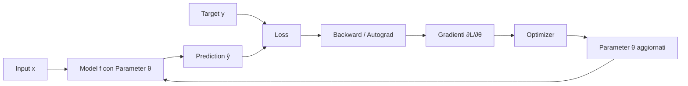
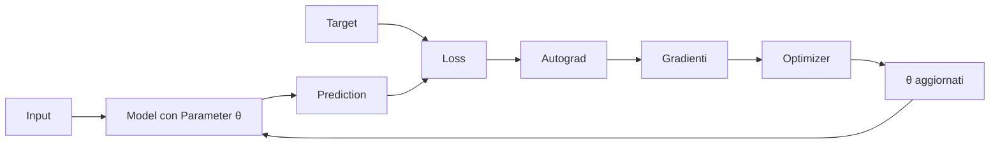

# 03 — Dalla prediction all'aggiornamento dei parametri

## Scopo e posizione nella mappa

Il capitolo precedente ha costruito il percorso che va dal `Tensor` alla rete neurale. Il modello può ora trasformare un input in una prediction, ma una prediction non costituisce ancora apprendimento.

Questo capitolo completa il primo ciclo di training:

```text
MODELLO
Input → Neural Network → Prediction
                            ↓
TRAINING LOOP               Loss
                            ↓
                         Backward
                            ↓
                         Gradients
                            ↓
                         Optimizer
                            ↓
                    Parameter Update
                            ↺
                       nuovo Forward
```

Attraverseremo tre livelli di astrazione, segnalandone i confini:

- **matematica**: definiamo un obiettivo scalare e le sue derivate;
- **architettura**: separiamo modello, autograd e optimizer;
- **implementazione**: seguiamo gli oggetti reali di MyTorch durante un passo di training.

### Zoom out: la rete dentro un sistema di apprendimento

Una rete neurale isolata realizza il contratto:

```text
input → model(parameters) → prediction
```

In notazione matematica indicheremo lo stesso modello con

```text
ŷ = f(x; θ)
```

dove `x` è l'input, `θ` è l'insieme dei parametri apprendibili e `ŷ` è la
prediction. Quando passeremo all'obiettivo useremo `L` per il valore contenuto
nel `Tensor` chiamato `loss` nel codice.

Il training la colloca in un sistema più ampio:

```text
                 ┌──────── MODELLO ────────┐
input ──────────→│ parameters → prediction │
                 └──────────────┬──────────┘
                                ↓
target ───────────────────────→ loss
                                ↓
                           gradients
                                ↓
                         parameter update
                                │
                                └────→ MODELLO modificato
```

Il deep dive non introduce un nuovo tipo di rete. Spiega il ciclo esterno che ne modifica lo stato. La topologia dei `Module` rimane stabile; cambiano i valori dei `Parameter`.

Le quattro prospettive si distribuiscono così:

```text
MATEMATICA       obiettivo scalare e discesa del gradiente
ARCHITETTURA     separazione Model / Loss / Autograd / Optimizer
STATO            data e grad dei Parameter
ESECUZIONE       forward → backward → step → nuovo forward
```

### Diagramma del sottosistema



Gli ingredienti del training loop sono:

1. **Input** — dato su cui viene eseguito il modello.
2. **Model** — funzione parametrica che produce la prediction.
3. **Prediction** — output differenziabile del modello.
4. **Target** — riferimento fornito dal dataset, esterno al modello.
5. **Loss** — criterio scalare che stabilisce che cosa debba essere migliorato.
6. **Backward** — attraversamento inverso della computazione costruita dal forward.
7. **Gradienti** — sensibilità della loss rispetto ai Parameter.
8. **Optimizer** — strategia che converte gradienti in aggiornamenti.
9. **Parameter update** — mutazione persistente dello stato del modello.
10. **Nuovo forward** — nuova esecuzione necessaria per osservare il modello aggiornato.

I confini architetturali sono:

```text
APPARTIENE AL MODELLO
Parameter, Module, forward, prediction

APPARTIENE AI DATI / TASK
input, target

APPARTIENE AL TRAINING SYSTEM
loss, backward, optimizer, iterazione
```

Il diagramma è un ciclo perché il training ripete la computazione dopo ogni aggiornamento; il grafo di una singola iterazione, invece, è la storia concreta di quel forward e backward.

---

## 3.1 Prediction e target non hanno lo stesso ruolo

La prediction è l'output differenziabile del modello. Il target è il valore rispetto al quale vogliamo valutarla:

```text
input → model(parameters) → prediction
                                  ↘
                                    loss
                                  ↗
                              target
```

La prediction dipende dai parametri attraverso il grafo computazionale. Il target, nel caso supervisionato corrente, è un dato osservato e non richiede gradienti.

Nel training loop di [`mytorch/main.py`](../mytorch/main.py):

```python
x = Tensor([x_value])
target = Tensor([target_value])

prediction = model(x)
loss = loss_fn(prediction, target)
```

`prediction.creator` collega l'output alle operazioni del modello. `target.creator` è `None`. La loss combina entrambi, ma il backward attraversa soltanto i tensori per cui `requires_grad` è vero.

---

## 3.2 Loss: trasformare un criterio in uno scalare

### Matematica

Per una prediction vettoriale \(\hat{y}\) e un target \(y\), la Mean Squared Error è

```text
              1   n
MSE(ŷ, y) =  ───  Σ (ŷᵢ - yᵢ)²
              n  i=1
```

Qui `n` è il numero totale di elementi della prediction, non soltanto la
dimensione del suo primo asse. La loss riduce molti scarti a un singolo numero.
Questo scalare svolge due funzioni:

1. fornisce un criterio con cui confrontare stati diversi del modello;
2. diventa la radice da cui avviare la reverse-mode autodiff.

La riduzione scalare non è un vincolo universale della differenziazione: `backward()` potrebbe ricevere esplicitamente un gradiente per un output non scalare. È però la forma naturale dell'obiettivo di ottimizzazione usato nel training corrente.

### Architettura

La loss non appartiene al modello. Il modello produce una prediction; la loss stabilisce come valutarla rispetto al target. Lo stesso modello potrebbe essere addestrato con criteri differenti senza modificare il suo `forward()`.

### Implementazione

[`mytorch/losses.py`](../mytorch/losses.py) costruisce la MSE componendo operazioni già differenziabili:

```python
error = prediction - target
squared_error = error ** 2

if prediction.shape == ():
    return squared_error

total = squared_error.sum()

n = 1
for dimension in prediction.shape:
    n *= dimension

if n == 0:
    raise ValueError("MSELoss is undefined for an empty tensor.")

return total * Tensor(1.0 / n)
```

Il ramo scalare evita una riduzione superflua. Per un tensore non scalare, il
prodotto delle dimensioni realizza la media su tutti gli elementi, inclusi
eventuali assi di batch e di feature.

Non esiste un `MSEBackward` speciale. Durante il forward si aggiungono al grafo, nell'ordine:

```text
prediction ─┐
            ├→ Subtract → Power(2) → Sum → Multiply → loss
target ─────┘                                      ↑
                                                  scale
```

Le regole locali di `Subtract`, `Power`, `Sum` e `Multiply` sono sufficienti per propagare il gradiente fino alla prediction e, da lì, ai parametri.

Un uso minimo rende osservabili valore, shape scalare e gradiente rispetto alla
prediction:

```python
from mytorch import MSELoss, Tensor

prediction = Tensor([2.0, 4.0], requires_grad=True)
target = Tensor([1.0, 1.0])

loss = MSELoss()(prediction, target)
loss.backward()

print(loss.data, loss.shape)
print(prediction.grad)
```

Output:

```text
5.0 ()
[1.0, 3.0]
```

Infatti `L = ((2 - 1)² + (4 - 1)²) / 2 = 5` e
`∂L/∂ŷ = 2(ŷ - y)/2 = [1, 3]`.

---

## 3.3 Backward: interrogare il grafo

La chiamata

```python
loss.backward()
```

non modifica ancora i parametri. Calcola e accumula i gradienti.

Poiché `loss` è scalare, MyTorch usa implicitamente il seed

```text
∂loss/∂loss = 1
```

e attraversa a ritroso la storia costruita dal forward:

```text
loss
  ↓
operazioni della loss
  ↓
prediction
  ↓
operazioni del modello
  ↓
parameters
```

Al termine, per ogni parametro \(\theta\), il campo `theta.grad` contiene

```text
∂loss / ∂θ
```

Il gradiente descrive la sensibilità locale della loss. Non è ancora un aggiornamento e non contiene da solo una politica su come cambiare il parametro.

---

## 3.4 Perché i gradienti si accumulano

In [`mytorch/tensor.py`](../mytorch/tensor.py), un nuovo contributo viene sommato a quello eventualmente esistente:

```python
def _accumulate_grad(self, grad):
    if self.grad is None:
        self.grad = _copy_nested(grad)
        return

    self.grad = _add_nested(self.grad, grad)
```

L'accumulazione è necessaria all'interno di un singolo grafo quando più cammini raggiungono lo stesso tensore:

```text
        ┌→ ramo A ─┐
Tensor ─┤          ├→ loss
        └→ ramo B ─┘
```

È anche osservabile tra chiamate successive a `backward()`: MyTorch non può presumere quando l'utente abbia terminato di raccogliere contributi. Questo comportamento permette, per esempio, di sommare gradienti provenienti da più esempi prima di effettuare un aggiornamento.

La conseguenza è importante: se ogni iterazione deve rappresentare un nuovo passo indipendente, i gradienti precedenti devono essere cancellati esplicitamente.

---

## 3.5 `zero_grad()`: definire il confine tra iterazioni

[`mytorch/optim.py`](../mytorch/optim.py) assegna all'optimizer la responsabilità di azzerare i gradienti dei parametri che gestisce:

```python
def zero_grad(self):
    for parameter in self.parameters:
        parameter.grad = None
```

`None` significa che nessun gradiente è stato ancora calcolato; non equivale concettualmente a un tensore di zeri già materializzato.

Nel loop corrente la sequenza è:

```python
optimizer.zero_grad()

prediction = model(x)
loss = loss_fn(prediction, target)

loss.backward()
optimizer.step()
```

L'azzeramento avviene prima del nuovo forward/backward e stabilisce che ciascun esempio produce un aggiornamento indipendente. Spostare `zero_grad()` dopo `step()` sarebbe possibile, purché avvenisse prima del backward successivo. La posizione scelta rende però esplicito l'inizio logico dell'iterazione.

Non bisogna dedurre che i gradienti vadano sempre azzerati dopo ogni esempio. Nel mini-batch o nella gradient accumulation intenzionale, più backward possono precedere lo stesso `step()`.

---

## 3.6 Optimizer: dal gradiente alla regola di aggiornamento

### Cambio di livello

Con `backward()` stavamo parlando di differenziazione. Con l'optimizer passiamo all'ottimizzazione: usiamo il gradiente per decidere una mutazione dello stato apprendibile.

Per Stochastic Gradient Descent, la regola è

```text
θ ← θ - η ∂loss/∂θ
```

dove `θ` indica un parametro, `∂loss/∂θ` il gradiente accumulato nel
campo `theta.grad` e `η` il learning rate, cioè la scala del passo compiuto
nella direzione opposta al gradiente. Nel codice, `loss` rappresenta lo scalare
matematico `L`, quindi scriveremo equivalentemente `∂L/∂θ`.

### Implementazione

La classe `SGD` riceve soltanto i parametri esposti dal modello:

```python
optimizer = SGD(model.parameters(), lr=0.01)
```

Il suo `step()` applica ricorsivamente la regola a scalari e liste annidate:

```python
def step(self):
    for parameter in self.parameters:
        if parameter.grad is None:
            continue

        parameter.data = _sgd_update(
            parameter.data,
            parameter.grad,
            self.lr,
        )
```

Le responsabilità rimangono separate:

```text
Autograd     calcola parameter.grad
Optimizer    legge parameter.grad e modifica parameter.data
Module       espone i Parameter posseduti
```

`SGD` non calcola gradienti, non esegue il modello e non decide la loss. Analogamente, `Tensor.backward()` non conosce learning rate o strategie di aggiornamento.

---

## 3.7 Un passo completo calcolato a mano

Consideriamo un singolo layer:

```text
Linear(1, 1)
weight = [[1.0]]
bias   = [0.0]
x      = [2.0]
target = [5.0]
η      = 0.1
```

### Forward del modello

```text
prediction = weight @ x + bias
           = 1 · 2 + 0
           = 2
```

### Forward della loss

Con un solo elemento, la MSE è:

```text
loss = (prediction - target)²
     = (2 - 5)²
     = 9
```

### Backward

```text
∂loss/∂prediction = 2(prediction - target) = -6

∂prediction/∂weight = x = 2
∂prediction/∂bias   = 1

∂loss/∂weight = -6 · 2 = -12
∂loss/∂bias   = -6 · 1 = -6
```

Dopo `loss.backward()`:

```text
weight.grad = [[-12]]
bias.grad   = [-6]
```

### Parameter update

```text
weight ← 1.0 - 0.1(-12) = 2.2
bias   ← 0.0 - 0.1(-6)  = 0.6
```

### Nuovo forward

Il grafo precedente ha prodotto i gradienti, ma è la mutazione di `parameter.data` a cambiare il comportamento del modello:

```text
new_prediction = 2.2 · 2 + 0.6 = 5.0
new_loss       = (5.0 - 5.0)²  = 0.0
```

In questo esempio il learning rate porta esattamente al target in un passo. Non è una proprietà generale di SGD; è una conseguenza dei valori scelti per rendere trasparente il ciclo.

Lo stesso passo è eseguibile attraverso l'API pubblica corrente:

```python
from mytorch import Linear, MSELoss, SGD, Tensor

layer = Linear(1, 1)
layer.weight.data = [[1.0]]
layer.bias.data = [0.0]

x = Tensor([2.0])
target = Tensor([5.0])
loss_fn = MSELoss()
optimizer = SGD(layer.parameters(), lr=0.1)

optimizer.zero_grad()
prediction = layer(x)
loss = loss_fn(prediction, target)
loss.backward()

print(prediction.data, loss.data)
print(layer.weight.grad, layer.bias.grad)

optimizer.step()
new_prediction = layer(x)
new_loss = loss_fn(new_prediction, target)

print(layer.weight.data, layer.bias.data)
print(new_prediction.data, new_loss.data)
```

Output:

```text
[2.0] 9.0
[[-12.0]] [-6.0]
[[2.2]] [0.6000000000000001]
[5.0] 0.0
```

La rappresentazione `0.6000000000000001` è il normale risultato
dell'aritmetica floating-point binaria; matematicamente il bias aggiornato è
`0.6`.

---

## 3.8 Il loop come macchina a stati

Un'iterazione può essere letta come una sequenza di stati osservabili:

```text
1. parametri correnti, gradienti vuoti
                 ↓ forward
2. prediction e grafo costruito
                 ↓ loss
3. obiettivo scalare collegato al modello
                 ↓ backward
4. gradienti accumulati nei parametri
                 ↓ step
5. parametri aggiornati
                 ↓ nuovo forward
6. nuova prediction
```

Il ciclo non modifica la struttura del modello. Modifica i valori dei suoi parametri. A parità di input, il nuovo forward produce quindi una prediction diversa.

Questa lettura impedisce tre confusioni frequenti:

- il backward non aggiorna i pesi;
- l'optimizer non costruisce i gradienti;
- la loss non appartiene alla rete neurale.

---

## 3.9 Invarianti verificate dai test

[`mytorch/tests.py`](../mytorch/tests.py) rende eseguibili alcune proprietà architetturali:

```text
test_backward_accumulates_parameter_gradients
    più backward sommano i contributi

test_sgd_zero_grad
    zero_grad cancella i gradienti gestiti dall'optimizer

test_module_discovers_nested_parameters
    un modello espone ricorsivamente i Parameter dei sottomoduli

test_sgd_step_updates_parameters_only
    step muta i Parameter, non i dati di input

test_single_training_step_reduces_loss
    forward → loss → backward → step cambia il modello
    e riduce la loss nel caso deterministico
```

I test non dimostrano che qualsiasi training converga. Verificano invece i contratti locali necessari affinché un algoritmo di training possa funzionare.

---

## 3.10 Confine raggiunto e prossimo livello

Con questo capitolo MyTorch chiude un ciclo completo:

```text
calcolo differenziabile
        ↓
composizione del modello
        ↓
valutazione della prediction
        ↓
calcolo dei gradienti
        ↓
aggiornamento dei parametri
```

Alla frontiera didattica raggiunta in questo punto del percorso, la limitazione
principale non è più l'assenza di un training loop, ma la scala su cui sappiamo
ancora descriverlo: singoli vettori, `MatMul` matrice-vettore e nessun
broadcasting. Il repository corrente contiene già le estensioni sviluppate nei
capitoli 4 e 5; qui isoliamo intenzionalmente il sistema così come si presenta
prima di quelle generalizzazioni.

Il prossimo cambio architetturale appartiene quindi alla sezione **scalabilità** della MAP:

```text
Broadcasting → Batch → MatMul generale → Vectorization
```

Prima di introdurre ottimizzatori più sofisticati o architetture più profonde, occorre capire come le stesse responsabilità si conservano quando una singola osservazione diventa un batch e le operazioni devono gestire forme più generali.

---

## Ricomposizione: il modello che apprende

Il training loop ricompone i componenti senza fondere le loro responsabilità:



```text
MODEL
  legge Parameter e produce prediction
        ↓
LOSS
  collega prediction e target in un obiettivo scalare
        ↓
AUTOGRAD
  usa il grafo per scrivere i gradienti nei Parameter
        ↓
OPTIMIZER
  usa i gradienti per modificare i valori dei Parameter
        ↓
MODEL
  mantiene la stessa struttura ma produce un nuovo comportamento
```

Rispetto all'anatomia della rete:

```text
matematica      la funzione f(x; θ) conserva la forma, cambia θ
architettura    la gerarchia dei Module non cambia
stato           parameter.data viene aggiornato
esecuzione      ogni iterazione costruisce un nuovo grafo
```

Abbiamo così chiuso il primo sistema di apprendimento completo. Il limite successivo non riguarda più la presenza del ciclo, ma la scala su cui viene eseguito: le operazioni lavorano ancora su shape molto ristrette. I capitoli 4 e 5 ingrandiscono quindi l'infrastruttura tensoriale senza alterare i confini appena consolidati.

## Sintesi del capitolo

```text
Prediction
  output differenziabile del modello
      ↓
Loss
  costruisce un obiettivo scalare mediante Operations
      ↓
Backward
  attraversa il grafo e compone derivate locali
      ↓
Gradients
  si accumulano nei Tensor e nei Parameter
      ↓
Optimizer
  applica una regola di aggiornamento
      ↓
Parameter Update
  muta lo stato apprendibile del modello
      ↓
New Forward
  rende osservabile l'effetto dell'apprendimento
```

L'apprendimento non risiede in un singolo oggetto. Emerge dalla cooperazione tra un modello che produce prediction, una loss che definisce l'obiettivo, Autograd che calcola sensibilità locali e un optimizer che modifica esclusivamente lo stato apprendibile.
