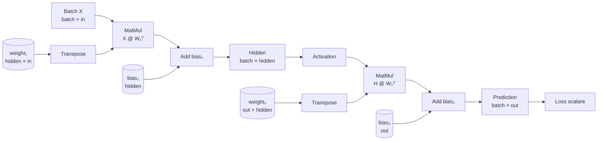
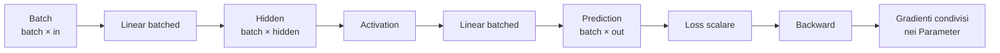

# 05 — Batch, MatMul generale e Linear batched

## Scopo e posizione nella mappa

Il capitolo 4 ha introdotto il broadcasting: Tensor con shape differenti possono partecipare alla stessa operazione element-wise, purché esista una corrispondenza non ambigua tra le dimensioni.

Ora usiamo quella infrastruttura per superare il limite del singolo esempio:

```text
SCALABILITÀ
Shape → Broadcasting → Batch → MatMul generale → Vectorization
```

Il passaggio fondamentale è:

```text
singolo esempio                 batch
x.shape = (features,)           X.shape = (batch_size, features)
```

Un batch non introduce un nuovo tipo di dato. Introduce un asse che organizza più esempi omogenei nello stesso `Tensor`. Perché il modello possa elaborarli insieme, `MatMul`, `Linear`, broadcasting del bias e loss devono concordare sulla semantica delle shape.

### Zoom out: dalla rete sul singolo esempio alla stessa rete sul batch

Sul singolo esempio, il modello applica:

```text
x (features,) → Linear → h (hidden,) → ... → prediction (out,)
```

Sul batch vogliamo applicare **gli stessi layer e gli stessi Parameter** a più righe:

```text
X (batch, features) → Linear → H (batch, hidden)
                             → ...
                             → prediction (batch, out)
```

Non costruiamo una rete per ogni esempio:

```text
NO:  model₀(x₀), model₁(x₁), model₂(x₂)

SÌ:  lo stesso model e gli stessi Parameter operano su X
```

Il cambiamento appartiene soprattutto all'esecuzione:

```text
MATEMATICA       la stessa funzione viene applicata a ogni esempio
ARCHITETTURA     la gerarchia di Module rimane invariata
STATO            weight e bias rimangono condivisi
ESECUZIONE       compare l'asse batch e MatMul lavora su matrici
```

Il deep dive deve mostrare come preservare questa equivalenza e come aggregare nel backward i contributi di tutti gli esempi.

### Diagramma del sottosistema



Gli ingredienti del calcolo batched sono:

1. **Esempio** — una singola osservazione rappresentata da un vettore di feature.
2. **Batch** — più esempi omogenei raccolti lungo un nuovo asse.
3. **Batch size** — numero di esempi presenti nel batch.
4. **Feature axis** — asse che contiene le componenti di ogni esempio.
5. **MatMul** — moltiplicazione che contrae le dimensioni interne e combina le feature.
6. **Transpose** — riordina gli assi dei pesi per renderli compatibili con esempi memorizzati per righe.
7. **Linear batched** — applica gli stessi weight e bias a ogni riga del batch.
8. **Broadcasting del bias** — riusa un solo bias su tutti gli esempi.
9. **Rappresentazione batched** — Tensor `(batch, features)` prodotto tra i layer.
10. **Loss aggregata** — obiettivo scalare che riassume gli errori di esempi e output.
11. **Gradienti condivisi** — somma dei contributi di tutto il batch negli stessi Parameter.

I confini sono:

```text
ARCHITETTURA DEL MODELLO
layer, Parameter e collegamenti rimangono invariati

ORGANIZZAZIONE DEI DATI
compare l'asse batch

ESECUZIONE NUMERICA
MatMul e broadcasting elaborano più esempi insieme

AGGREGAZIONE DEL TRAINING
loss e gradienti raccolgono i contributi del batch
```

Il capitolo non introduce una nuova rete: generalizza l'esecuzione della rete già costruita.

---

## 5.1 Perché introdurre il batch

Nel training originale, il modello riceve un esempio alla volta:

```python
for x_value, target_value in training_data:
    x = Tensor([x_value])
    prediction = model(x)
```

Per `features = 3`, un singolo input ha forma:

```text
x = [x₀, x₁, x₂]
x.shape = (3,)
```

Un batch di due esempi li dispone per righe:

```text
X = [[x₀₀, x₀₁, x₀₂],
     [x₁₀, x₁₁, x₁₂]]

X.shape = (2, 3)
          ↑  ↑
       batch features
```

La prima dimensione identifica l'esempio; la seconda identifica la componente dell'esempio.

Il batch serve a due livelli:

```text
MATEMATICA
  aggrega il contributo di più osservazioni in un obiettivo

ESECUZIONE
  esprime molte computazioni indipendenti come algebra tensoriale
```

Nell'implementazione corrente con liste Python non otteniamo ancora una vera accelerazione numerica. Costruiamo però il contratto di shape che renderà possibile la futura vettorizzazione.

---

## 5.2 MatMul e Multiply sono operazioni differenti

`Multiply` applica un prodotto elemento per elemento:

```text
Cᵢⱼ = Aᵢⱼ Bᵢⱼ
```

`MatMul` contrae una dimensione condivisa:

```text
Cᵢⱼ = Σₖ Aᵢₖ Bₖⱼ
```

Il simbolo `k` non compare nell'output: viene eliminato dalla somma. Questa contrazione è ciò che collega le feature in ingresso alle feature in uscita.

In MyTorch:

```python
a * b    # Multiply
a @ b    # MatMul
```

Il broadcasting implementato nel capitolo 4 appartiene alle operazioni element-wise. `MatMul` ha regole di compatibilità proprie, determinate dalle dimensioni contratte.

---

## 5.3 I quattro casi di MatMul

La nuova `MatMul` supporta Tensor 1D e 2D.

### Vettore per vettore

```text
(k,) @ (k,) → ()
```

È il prodotto scalare:

```text
[a₀, a₁, a₂] @ [b₀, b₁, b₂]
= a₀b₀ + a₁b₁ + a₂b₂
```

### Matrice per vettore

```text
(m, k) @ (k,) → (m,)
```

Ogni riga della matrice produce una componente del risultato. È il caso usato dal `Linear` per un singolo esempio:

```text
W @ x
```

### Vettore per matrice

```text
(k,) @ (k, n) → (n,)
```

Il vettore viene contratto con le righe della matrice e rimane la dimensione delle colonne.

### Matrice per matrice

```text
(m, k) @ (k, n) → (m, n)
```

La regola di compatibilità è sempre:

```text
ultima dimensione del primo operando
                    =
prima dimensione del secondo operando
```

La dimensione condivisa `k` viene contratta. Le dimensioni esterne `m` e `n` formano la shape dell'output.

---

## 5.4 Implementazione del forward

In [`mytorch/operations.py`](../mytorch/operations.py), `MatMul.forward()` distingue i casi attraverso il rango:

```python
rank_a = len(a.shape)
rank_b = len(b.shape)

if rank_a not in (1, 2) or rank_b not in (1, 2):
    raise ValueError("MatMul supports only 1D and 2D tensors.")

inner_a = a.shape[-1]
inner_b = b.shape[0]
if inner_a != inner_b:
    raise ValueError(
        f"Incompatible MatMul shapes: {a.shape} @ {b.shape}."
    )
```

Per il caso matrice-matrice:

```python
rows = a.shape[0]
cols = b.shape[1]
return [
    [
        sum(a.data[i][k] * b.data[k][j] for k in range(inner_a))
        for j in range(cols)
    ]
    for i in range(rows)
]
```

Gli indici rendono esplicita la contrazione:

```text
i    seleziona una riga di a
j    seleziona una colonna di b
k    attraversa la dimensione condivisa e viene sommato
```

---

## 5.5 Backward della moltiplicazione tra matrici

Consideriamo:

```text
C = A @ B

A.shape = (m, k)
B.shape = (k, n)
C.shape = (m, n)
```

Se il gradiente ricevuto da valle è

```text
G = ∂L/∂C
```

allora:

```text
∂L/∂A = G @ Bᵀ
∂L/∂B = Aᵀ @ G
```

Le shape verificano il contratto:

```text
G       @ Bᵀ      → grad_A
(m, n)  @ (n, k)  → (m, k)

Aᵀ      @ G       → grad_B
(k, m)  @ (m, n)  → (k, n)
```

MyTorch calcola direttamente questi prodotti tramite indici, evitando di costruire un nuovo grafo dentro `backward()`:

```python
grad_a = [
    [
        sum(grad_output[i][j] * b.data[k][j] for j in range(cols))
        for k in range(inner)
    ]
    for i in range(rows)
]

grad_b = [
    [
        sum(a.data[i][k] * grad_output[i][j] for i in range(rows))
        for j in range(cols)
    ]
    for k in range(inner)
]
```

La formula matriciale e i loop esprimono la stessa relazione a due livelli differenti.

---

## 5.6 Transpose come Operation differenziabile

Per esprimere un `Linear` batched mantenendo i pesi nella convenzione già adottata, serve la trasposizione:

```text
weight.shape   = (out_features, in_features)
weight.T.shape = (in_features, out_features)
```

MyTorch espone:

```python
weight.T
```

La trasposizione non è una semplice manipolazione esterna dei dati. Se `weight.T` partecipa al forward, Autograd deve poter riportare il gradiente a `weight`. Per questo `Transpose` è una `Operation`:

```python
class Transpose(Operation):
    def forward(self, x):
        ...

    def backward(self, grad_output):
        ...
        return (grad_x,)
```

Matematicamente:

```text
Y = Xᵀ
∂L/∂X = (∂L/∂Y)ᵀ
```

La trasposizione è la propria operazione inversa.

---

## 5.7 Linear su un singolo esempio

I pesi conservano la convenzione introdotta nel capitolo 2:

```text
weight.shape = (out_features, in_features)
bias.shape   = (out_features,)
```

Per un singolo input:

```text
x.shape = (in_features,)
```

il calcolo rimane:

```text
weight @ x + bias

(out, in) @ (in,) → (out,)
(out,) + (out,)   → (out,)
```

---

## 5.8 Linear su un batch

Un batch memorizza gli esempi per righe:

```text
X.shape = (batch_size, in_features)
```

Per produrre una riga di output per ogni riga di input, il calcolo diventa:

```text
X @ weight.T + bias
```

Le shape sono:

```text
X              (batch_size, in_features)
weight.T       (in_features, out_features)
------------------------------------------------
X @ weight.T   (batch_size, out_features)
bias                         (out_features,)
------------------------------------------------
output         (batch_size, out_features)
```

La trasposizione non cambia il significato con cui i pesi sono memorizzati; li orienta per la contrazione con un batch row-major.

Il codice in [`mytorch/layers.py`](../mytorch/layers.py) rende espliciti i due contratti:

```python
def forward(self, x):
    if x.shape == (self.in_features,):
        return self.weight @ x + self.bias

    if len(x.shape) == 2 and x.shape[1] == self.in_features:
        return x @ self.weight.T + self.bias

    raise ValueError(...)
```

`Linear` è lo stesso layer e possiede gli stessi `Parameter`; cambia soltanto l'organizzazione dell'input.

---

## 5.9 Il bias condiviso e il ruolo del broadcasting

Dopo `X @ weight.T`, l'output provvisorio ha shape:

```text
(batch_size, out_features)
```

Il bias ha shape:

```text
(out_features,)
```

Il broadcasting del capitolo 4 applica lo stesso bias a tutte le righe:

```text
[[z₀₀, z₀₁],       [b₀, b₁]
 [z₁₀, z₁₁]]   +

→ [[z₀₀+b₀, z₀₁+b₁],
   [z₁₀+b₀, z₁₁+b₁]]
```

Nel backward, il gradiente del bias somma i contributi del batch:

```text
grad_bias[j] = Σ grad_output[i, j]
               i
```

Il batch rende concreto il motivo per cui il backward del broadcasting deve ridurre gli assi replicati.

---

## 5.10 Gradienti condivisi nel Linear batched

Per

```text
Y = X @ Wᵀ + b
```

con

```text
G = ∂L/∂Y
```

le relazioni sono:

```text
∂L/∂X = G @ W
∂L/∂W = Gᵀ @ X
∂L/∂b = somma di G sull'asse batch
```

Interpretazione:

- ogni esempio riceve un gradiente rispetto alle proprie feature;
- tutti gli esempi contribuiscono allo stesso `weight`;
- tutti gli esempi contribuiscono allo stesso `bias`.

Il batch non crea una copia dei parametri per osservazione. Gli stessi parametri vengono riutilizzati, quindi i loro gradienti aggregano tutti i contributi.

---

## 5.11 MSE su più dimensioni

La MSE deve fare la media su tutti gli elementi di prediction e target, non soltanto sulla prima dimensione.

Per shape `(batch_size, out_features)`:

```text
n = batch_size × out_features
```

L'implementazione aggiornata calcola il numero totale di scalari:

```python
n = 1
for dimension in prediction.shape:
    n *= dimension

scale = Tensor(1.0 / n)
return total * scale
```

La loss rimane scalare:

```text
prediction (batch, out) → error² → sum → scale → loss ()
```

Questa scelta assegna uguale peso a ogni elemento del batch e delle feature di output.

---

## 5.12 Esempio completo

Consideriamo:

```text
Linear(3, 2)

X = [[1, 0, 1],
     [0, 2, 1]]

W = [[1, 2, 3],
     [4, 5, 6]]

b = [0.5, -0.5]
```

Le shape sono:

```text
X    (2, 3)
W    (2, 3)
Wᵀ   (3, 2)
b       (2,)
```

Il forward produce:

```text
X @ Wᵀ + b

= [[4.5,  9.5],
   [7.5, 15.5]]
```

Se la loss è la somma di tutti gli output, `G` è una matrice di `1`. Il backward produce:

```text
grad_X = [[5, 7, 9],
          [5, 7, 9]]

grad_W = [[1, 2, 2],
          [1, 2, 2]]

grad_b = [2, 2]
```

Ogni riga di `grad_W` riceve la somma degli input del batch perché entrambe le componenti di output entrano nella loss con gradiente unitario.

---

## 5.13 Invarianti verificate dai test

[`mytorch/tests.py`](../mytorch/tests.py) verifica:

```text
test_vector_dot_product_backward
  (k,) @ (k,) → ()

test_matmul_backward
  (m, k) @ (k,) → (m,)

test_vector_matrix_matmul_backward
  (k,) @ (k, n) → (n,)

test_matrix_matrix_matmul_backward
  (m, k) @ (k, n) → (m, n)

test_transpose_backward
  forward e backward invertono i due assi

test_batched_linear_forward_and_backward
  Linear condivide pesi e bias tra gli esempi

test_batched_mse_mean_and_backward
  la media include batch e feature di output
```

I test controllano forward, shape e gradienti di entrambi gli operandi. Una generalizzazione di `MatMul` non è completa se produce valori corretti ma perde uno dei percorsi del backward.

---

## 5.14 Limiti e prossima frontiera

La `MatMul` corrente è generale rispetto alle combinazioni 1D/2D, ma non supporta ancora:

- Tensor con rango superiore a due;
- batch multidimensionali di matrici;
- broadcasting degli assi batch dentro `MatMul`;
- kernel vettorizzati;
- storage NumPy;
- dtype e device.

Il batch è espresso correttamente, ma i loop Python continuano a visitare ogni elemento. La prossima frontiera della MAP è quindi la **vectorization**: separare la semantica che abbiamo costruito dal modo inefficiente in cui viene eseguita.

Questo sarà anche il punto naturale per introdurre PyTorch come termine di confronto:

```text
stesso contratto di shape
stessa algebra
stesso backward atteso
        ↓
implementazione MyTorch esplicita
confrontata con
implementazione PyTorch vettorizzata
```

---

## Ricomposizione: la rete batched

Possiamo ora rileggere l'intera rete senza entrare nei loop di `MatMul`:



```text
X (batch, in)
  ↓
Linear: X @ W₁ᵀ + b₁
  ↓
H (batch, hidden)
  ↓
ReLU
  ↓
H' (batch, hidden)
  ↓
Linear: H' @ W₂ᵀ + b₂
  ↓
Prediction (batch, out)
  ↓
MSE media su batch × out
  ↓
Loss scalare
```

Nel backward:

```text
ogni riga riceve il proprio gradiente rispetto all'input
                    +
tutte le righe contribuiscono agli stessi weight e bias
```

Le quattro prospettive tornano a coincidere sull'oggetto completo:

```text
matematica      f viene applicata a più osservazioni
architettura    il modello contiene gli stessi layer
stato           i Parameter sono condivisi dal batch
esecuzione      MatMul e broadcasting elaborano l'asse aggiuntivo
```

Il batch è quindi una generalizzazione dell'esecuzione, non una nuova architettura di rete. Il prossimo limite è che MyTorch realizza questa algebra con liste e loop Python. La semantica è ora sufficientemente stabile per confrontarla con un backend vettorizzato e, successivamente, con PyTorch.

Nella MAP:

```text
Shape → Broadcasting → Batch → MatMul 1D/2D
                                      ↓
                              prossimo zoom:
                    Vectorization → Backend → PyTorch
```

## Sintesi del capitolo

```text
SINGOLO ESEMPIO
(features,)
      ↓ aggiunta asse batch
BATCH
(batch_size, features)
      ↓
MATMUL GENERALE 1D/2D
contrae le dimensioni interne
      ↓
LINEAR BATCHED
X @ Wᵀ + b
      ↓
BROADCASTING DEL BIAS
riusa b su ogni esempio
      ↓
BACKWARD
somma nei Parameter condivisi
      ↓
LOSS SCALARE
media su tutti gli elementi
```

Il batch non cambia il modello matematico applicato a ciascun esempio. Cambia l'organizzazione del calcolo: più esempi attraversano insieme gli stessi parametri, e il backward aggrega nei parametri i contributi prodotti da tutti loro.
